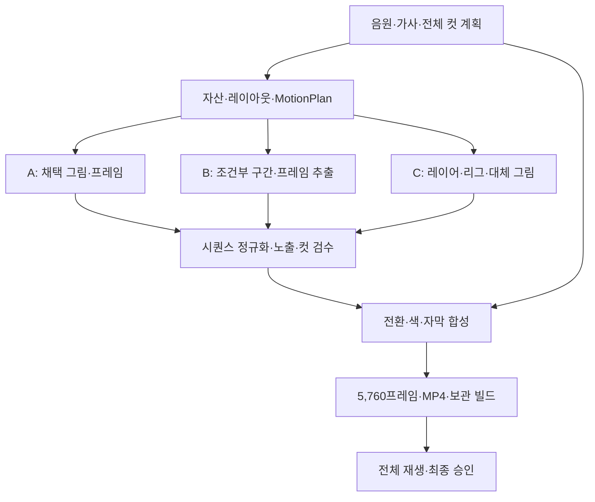

# FILM UNIT MV Compiler — 이미지 기반 애니메이션 적용 검토·개발 설계

작성일: 2026-09-30, 한국 시간  
대상: BeautifulMind-JT/film-unit-mv-studio  
기준 main: **1f5684a8f19893d8f83f487cf329bb2425eeb25b**, PR #17 병합 상태  
요구사항: 첨부 「4분 이미지 기반 애니메이션 제작 설계안 — 최종 통합 개정본」 전체  
문서 성격: **User가 채택한 방향의 개발 기준**. [채택 결정](decisions/FRAME_ANIMATION_V1_ADOPTION_20260930.md)에 따라 새 모드의 ANIM-001~018에 적용하며 제품 코드 변경이나 제작·과금·최종 출력 승인을 뜻하지 않는다. 이 수정본의 독립 감사와 병합은 별도 게이트다.

설계 revision 2 (2026-09-30): User의 Drive 기반 컴파일·AI 구독 실행·복수 인코더·성능 우선 지시를 반영했다. 저장·실행·인코더·원격 보관의 정본은 [실행·저장 성능 설계](FRAME_ANIMATION_V1_EXECUTION_STORAGE_KO.md)다. 해당 문서 2절은 최초 로컬 전용 제안에서 변경한 계약을 명시한다. 제품 코드 확인 main은 41e40478505cf75cf441dd4075c071a0fc462dbf이며 기존 코드 근거 링크는 최초 검토 SHA를 보존한다.

설계 revision 3 (2026-09-30): 옵션 A 채택 경로의 결정 기록과 ARCHITECTURE.md·PROJECT_SPEC.md의 새 모드 예외를 추가했다. main 41e4047의 AGENTS·공유 정책 변경을 이 브랜치에 함께 통합해 감사 입력에 포함한다. remote worker에는 사용자 OAuth token을 전달하지 않는 중개 전송을 기본으로 고정하고, cancel/UNKNOWN 및 명시적 bounded retry를 보완했다. 최초 문서의 외부 CI·중앙 host 상태는 작성자가 제공한 탐색 포인터이며 이번 감사의 로컬 입력만으로 입증된 실적으로 취급하지 않는다.

## 1. 판단

**적용 가능하다. 기존 Film Unit의 프로젝트·프레임 계약을 유지하며, 제작 계층과 저장·실행·인코더 선택 계층을 추가한다. 새 모드의 실행 위치를 PC에 고정하지 않는다.**

현재 compiler는 이미 음원과 가사를 독립적으로 보존하고, 외부에서 만든 샷을 선택·교체하며, 전체 곡을 편집하고 빌드를 보관한다. PR #17의 브라우저 hand-off도 이미지 중심 제작에 활용할 수 있다. 기존 저장소와 데스크톱 UI를 활용한다. 원격 실행은 실제 지원 서비스·worker 연결을 추가하며, 저장·실행 위치는 별도 계약으로 선택한다.

다만 현재의 ‘첫 이미지 → 샷 영상 → 이어 붙이기’만으로는 첨부안의 키포즈·브레이크다운·노출·레이어·전환·프레임 추적을 표현할 수 없다. **이미지 시퀀스를 완성 샷의 독립적인 자산 유형으로 받아들이고, 정확한 프레임 시간축과 제작·검수 상태를 추가해야 한다.** 규모상 작은 provider 추가보다 큰 변경이며, **v0.4의 명시적인 제작 모드**로 구현하는 것을 제안한다.

권장 순서는 **프레임·저장·실행·인코더 계약 → 외부 프레임의 정확한 컴파일 → native 합성·Drive/원격 실행·복수 인코더 → 생성 도구의 세밀한 제어 연결**이다. 로컬 기준선은 회귀·품질 비교에 사용하고 원격 계약은 ANIM-001부터 함께 설계한다. 작품에서는 A·B·C를 처음부터 배정할 수 있으나, 소프트웨어 개발은 이 순서로 위험을 줄인다. ‘프레임 파일을 컴파일할 수 있음’과 ‘모든 중간 동작을 자동으로 제작할 수 있음’은 각각 입증한다.

## 2. 확인 범위와 증거

main의 코드·문서·테스트 등 84개 파일을 Git blob SHA와 대조해 확보하고, 핵심 구현과 관련 테스트를 검토했다. 기준 SHA의 [Compiler regression 실행][CI]은 success이며, 워크플로는 Python 3.11·3.12에서 문법 검사와 전체 pytest를 수행하도록 구성되어 있다.

이번 검토에서 현재 validate_manifest를 직접 실행하면 겹치는 S002 구간에 **“Gap, overlap, or reversed range at S002”**가 발생했다. 제안 시간축의 96+96−12=180프레임 및 출력 90번에 대응하는 로컬 90번·6번도 별도로 계산했다.

기존 회귀의 240초·5,760프레임은 **합성 음원·320×240·혼합 자산 편집** 검증이다. 실제 애니메이션의 동작·연기·1080p 품질을 입증한 기록으로 확대 해석하지 않는다. 이 문서의 새 기능과 새 수용 테스트는 아직 구현·실행되지 않았다.

최초 코드 검토 시 PR #18은 열린 governance 변경이었다. revision 2에서 확인한 main 41e4047에는 #18이 병합되어 있으며 program-mode M1/M5 규칙을 반영한다. 새 애니메이션 기능 구현으로 집계하지 않는다. PR #2의 offline animatic과 PR #3의 Flow trial 역시 main의 애니메이션 제작 능력에 합산하지 않았다.

## 3. 기존 구현과 첨부 요구의 대응

| 첨부 요구 | 현재 상태 | 적용 설계 |
|---|---|---|
| 240초·24fps·5,760프레임 | 240초 회귀 및 전체 곡 프레임 계산 존재 | 특정 작품의 엄격한 출력 프로필 추가 |
| 1080p·16:9 | init에서 16:9·1920×1080 선택 가능; 기본은 4:3 | 작품별 설정으로 선택, 기존 기본값 자동 변경 안 함 |
| 음악·가사 기반 컷 구성 | 분석·절대 ms 컷·독립 가사 시간 존재 | 음악·가사 시간 보존, 새 모드는 정수 프레임 편집 |
| 마스터·참조 자산 | character/location 참조와 Bible 존재 | 자산 ID·버전·종류·준비 상태 확장 |
| 클린 플레이트·컷아웃·마스크 | 전용 자산·준비 상태 없음 | RGBA 원본, 보완·분리·합성 준비 기록 |
| 키포즈·브레이크다운 | 첫 프레임·자유로운 motion 설명 중심 | 시점과 사건을 가진 MotionPlan 추가 |
| ones/twos 및 레이어별 혼용 | 프로젝트 fps와 이미지 hold만 존재 | 레이어별 ExposureSchedule 추가 |
| A 이미지 기반 프레임 제작 | 참조/첫 프레임 생성만 연결 | 제어 이미지·채택 그림·시퀀스 가져오기 |
| B 조건부 구간 생성 | 기존 영상 renderer 활용 가능 | 구간별 능력 검사·끝점·원본 PTS 대응 |
| C 레이어·리깅·합성 | preview의 전체 이미지 hold/pan/zoom | 계층·기준점·대체 그림·native 합성; 로컬/원격 실행 |
| 전환 겹침 | contiguous ms manifest와 concat 중심 | 별도 프레임 편집 계약과 전환 합성 |
| 프레임별 다중 원본 추적 | 샷·파일 단위 SHA 기록 | 출력 프레임별 sources[]와 합성 recipe |
| 초기 본편 검증 | legacy 문서에 독립 3샷 비교 권고 | 실제 본편 W00 및 경로 체크포인트 |
| 컷 채택·최종 작품 승인 분리 | 샷 리뷰·제작 LOCK은 존재 | 실제 완성 출력 파일을 대상으로 하는 최종 승인 |
| 부분 수정·버전·재현 | 기존 강점 | 의존 그래프·프레임 캐시·시퀀스 replay로 확장 |
| 비용·노동·용량 관리 | 프로젝트별 USD/credits 예약 중심 | 준비·검수 노동과 저장량을 별도 장부로 기록 |

### 3.1. 착수 전에 해결할 구조상 충돌

| 우선순위 | 확인한 사실 | 필요한 변경 |
|---|---|---|
| 필수 | [core.validate_manifest][SRC_CORE]는 컷 overlap을 거부한다 | 새 모드에서는 frame edit validator 사용 |
| 필수 | [compiler._render_source][SRC_COMPILER]는 샷을 단일 영상/이미지로 정규화한다 | FRAME_SEQUENCE 및 COMPOSITE_SEQUENCE resolver |
| 필수 | [resolver.candidates][SRC_RESOLVER]의 움직이는 Final 후보는 검토된 영상이다 | 검토된 프레임 시퀀스도 동일한 동작 요건으로 승인 |
| 필수 | [core.lock_production][SRC_CORE]는 전체 placeholder 첫 프레임이 있으면 일반 LOCK을 거부한다 | 계획 승인과 선택한 제작 묶음 승인을 분리 |
| 필수 | [imagegen.fit_aspect][SRC_IMAGEGEN] 및 hand-off reference import는 RGB 변환 경로가 있다 | 컷아웃·마스크 전용 import에서 alpha·좌표 보존 |
| 필수 | [ImageProvider][SRC_IMAGEGEN]의 능력은 references 중심이며 포즈·마스크·끝점 계약이 없다 | 필요한 입력을 명시한 capability preflight |
| 필수 | [qc.inspect_clip][SRC_QC]는 generated=False에 기술적 PASS_LOCAL을 반환할 수 있다 | 로컬 제작 동작에도 별도 사람 검수 필수 |
| 필수 | [compiler/builds][SRC_COMPILER]의 Final 완료는 파일 생성 및 입력 조건 충족이다 | 완성 MP4 전체 재생 후 FinalApproval 추가 |
| 필수 | 기존 [replay_build][SRC_BUILDS]는 샷 concat으로 재편집한다 | 새 모드의 전환·프레임 합성·자막 시퀀스 replay 분기 |

프레임 시퀀스를 mp4로 먼저 바꾸어 기존 import-asset에 넣는 방식은 **중간 연결 수단**으로 사용할 수 있다. 하지만 그 방식만으로는 원본 그림·노출·레이어·프레임 추적이 사라지므로 새 모드의 정식 계약을 대신하지 못한다.

## 4. 목표 구조와 책임



| 계층 | 책임 | 결과 |
|---|---|---|
| 기획 LLM·감독 | 이야기·컷·감정·동작 사건·수정 제안 | 사람이 채택한 제작 계획 |
| 프로젝트 데이터 | 시간·참조·경로·버전·준비 상태 | 명시적인 제작 입력 |
| A/B/C 제작 도구 | 요청된 그림·구간·레이어 결과 | 후보와 채택 원본 |
| 프레임 실행기·worker | 노출·변형·합성·전환·번호·검사 | 추적 가능한 출력 프레임; 로컬/원격 선택 |
| 기존 MV 기능 | 원곡·가사·자막·빌드 보존·MP4 출력 | 후보 영상과 재현 자료 |
| 사람 | 컷 동작·연기·연결·작품 완료 판단 | 버전에 연결된 검수·승인 |

LLM은 매 프레임 전체 기획을 다시 쓰지 않는다. 번호·노출·합성·캐시·검사·인코딩은 고정 FramePlan을 선택된 CPU/GPU/runtime에서 실행한다. LLM의 추론과 서비스의 코드 실행 환경을 구분한다. compile은 creative generation을 임의 호출하지 않으며, 새 모드의 remote compose/encode는 선택한 실행 계획·사용 권한·비용 범위에 연결한다. [실행·저장 설계](FRAME_ANIMATION_V1_EXECUTION_STORAGE_KO.md)의 FrameStream·worker·encoder 계약을 따른다.

### 4.1. 기존 모드와 새 모드

기존 프로젝트는 LEGACY_MV로 동작한다. 현재 ms 타임라인·Final·cache·빌드를 그대로 읽는다. 새 프로젝트 또는 명시적인 전환을 거친 프로젝트만 FRAME_ANIMATION_V1을 사용한다.

새 모드의 편집 시간 정본은 timeline/edit.json이다. manifest/shots.json은 샷의 연출 정보와 MotionPlan 참조를 가진다. 기존 모듈에 필요한 in_ms/out_ms/duration_ms는 **읽기용 파생 view**로 만든다. 정수 프레임을 ms로 반올림했다가 다시 프레임으로 읽는 쓰기 경로는 만들지 않는다.

전환·노출·A/B/C를 render_mode 하나에 넣지 않는다. 새 샷에서는 STATIC/ANIMATED의 **동작 의도**, 구간별 **제작 경로**, 영상/시퀀스 등의 **결과 자산 종류**를 분리한다. STATIC 전환은 명시적인 감독 결정이다.

## 5. 데이터 계약

### 5.1. 버전

제안 패키지 버전은 v0.4이며 데이터 버전은 따로 관리한다.

| 데이터 | 현재 | 새 모드 제안 |
|---|---:|---:|
| Project | 3 | 4 |
| Shot | 2 | 3 |
| Lyrics | 1 | 1 유지 |
| Audio | 1 | 1 유지 |
| Build | 1 | 2 |
| AnimationPlan/Timeline | 없음 | 각 1 |
| Animation asset registry | 없음 | 1 |
| Animation review/approval | 없음 | 1, legacy review 2와 분리 |
| StorageArchive / ExecutionPlan | 없음 | 각 1 |
| CapabilityEvidence / EncodeRecipe | 없음 | 각 1 |
| WorkerProtocol / FrameStream | 없음 | 각 1 |

이 버전 번호는 제안이다. 구현자가 기존 버전 선언과 소비자를 확인해 확정하되, 미래 버전을 silently accept하는 동작은 허용하지 않는다.

### 5.2. 프로젝트 설정 예시

```yaml
schema_version: 4
production_profile: FRAME_ANIMATION_V1
format:
  width: 1920
  height: 1080
  fps: 24
  aspect_ratio: "16:9"
  crf: 18
animation:
  schema_version: 1
  output_frames: 5760
  timeline: timeline/edit.json
  assets: manifest/animation_assets.json
  roles: production/roles.json
  schedule: production/schedule.json
  storage_archive: manifest/storage_archive.json
  execution_plan: execution/plan.json
  initial_wave: W00
  delivery_sequence: SUBBED
```

1920×1080·16:9는 첨부안의 제안 기본값이며 작품에서 확정한다. 60컷은 계획 초기값으로만 다룬다. 240초 제한은 이 프로필의 작품 설정에 적용하며, Film Unit의 모든 노래를 강제로 4분으로 만들지 않는다. format.crf는 기존 FFmpeg 설정의 예시다. 다른 driver에 같은 숫자를 복사하지 않으며, 공통 delivery profile의 품질 조건과 driver별 EncodeRecipe를 구분한다.

### 5.3. 추가 파일

| 프로젝트 내 위치 | 정본으로 보존할 내용 |
|---|---|
| production/roles.json, schedule.json | 참여자·역할·시간·기한·검수 일정 |
| production/waves.json | 제작 순서·W00 대상 컷·확인할 어려운 유형 |
| production/route_decisions.jsonl | 유지·변경·혼용 및 적용 범위 |
| production/approvals.jsonl | 컷·전환·통합·최종 승인 기록 |
| production/labor_and_usage.csv | 준비·제작·검수·수정 시간과 사용량 |
| manifest/animation_assets.json | 자산 ID·버전·종류·바이트·준비 상태 |
| manifest/animation_locks.json | 계획·제작 묶음·최종 LOCK |
| manifest/storage_archive.json | 고정 storage object/member·hash·보존·접근 정보 |
| execution/plan.json | 고정 snapshot·작업 DAG·허용 runtime/driver·자원·사용권·예산 |
| execution/capabilities/ | 실제 probe·fixture·한도·유효 범위에 연결된 실행 능력 근거 |
| animation/shots/S001/plan.json | 레이아웃·사건·제어·구간·노출·경로 |
| animation/shots/S001/candidates/ | 미채택·수정·실패 결과 |
| animation/shots/S001/accepted/ | 채택 원본 및 시퀀스 인덱스 |
| timeline/edit.json | 편집 순서·사용 원본 범위·전환 |
| timeline/derived.json | 출력 위치·진행률 등 재계산 가능한 view |
| builds/B####/frame_map.jsonl | 빌드 출력별 다중 원본 관계 |
| builds/B####/final_frames/ | LOCAL_FULL의 최종 번호 PNG 시퀀스; DRIVE_BOUNDED는 아래 archive pack/index로 동등한 원본 보존 |
| builds/B####/archive/index.json | 원본·최종 PNG·출력·recipe의 immutable object/member·hash 대응; online replay와 파일 복원 |

기존 Bible·characters·locations·가사·render job·예산 파일을 없애지 않는다. CSV, UI 표, 요청 packet은 정본에서 파생한다. 사용자가 shot_list.csv를 수정해 반영하려면 검증 후 정본 변경을 하나의 명시적인 작업으로 수행한다. 위 파일은 사용자 작품의 프로젝트 데이터이며, 개발 작업의 mutable 실행 로그를 이 제품 저장소에 커밋하라는 뜻이 아니다. credential은 어떤 프로젝트·build 파일에도 저장하지 않는다.

### 5.4. 자산

자산은 asset_id, revision, kind, source/provenance, files[], content_digest, coordinate_space, dependencies[], preparation, acceptance를 가진다.

| kind | 추가로 필요한 내용 |
|---|---|
| MASTER_REFERENCE | 정면·측면 등 시점, 고정 외형, 적용 범위 |
| CLEAN_PLATE | 사용할 카메라 범위, 보완 영역, 그림자 처리 |
| LAYER_RGBA | 원본 alpha, canvas, crop origin, pivot, z-order |
| MASK | 대상으로 하는 자산과 버전, 범위·채널 의미 |
| REPLACEMENT_DRAWING | 교체 대상·시점·호환 리그 |
| RIG_SPEC | 부모·자식·기준점·허용 변형·가림 순서 |
| CONTROL_IMAGE | keypose/breakdown/pose/layout 종류와 목표 시점 |
| FRAME_SEQUENCE | frame index, 파일 hash, 노출·합성 recipe 참조 |
| VIDEO_CLIP | 원본 FPS·PTS·크기·사용 구간·정규화 대응 |

이미지 확보·분리·보완·리깅/합성 준비·채택은 구분한다. 모든 asset에 모든 단계를 강제하지 않고 선택한 경로에 필요한 준비만 확인한다. CLEAN_PLATE나 LAYER_RGBA에 ‘ready’만 적어 준비를 추정하지 않고 필요한 항목과 확인 근거를 기록한다.

내용을 바꾸면 새 revision을 만든다. 참조는 asset_id만이 아니라 **revision과 바이트 digest**까지 고정한다. 클린 플레이트를 창작해서 보완했다면 ‘제작용 배경 보완’으로 provenance를 남긴다.

투명 레이어는 기존 RGB 참조 import를 통과시키지 않는다. 별도 import에서 원본 RGBA·마스크·좌표를 보존하고, 색 프로필 변환이나 canvas 변경은 기록한다. 자동 crop으로 pivot과 레이어 위치를 바꾸지 않는다.

### 5.5. MotionPlan

필수 내용:

- shot_id와 plan revision, 동작 의도, 컷의 이야기·감정 역할.
- 채택 자산의 ID·revision·digest 및 layout 좌표.
- 시작·종료 상태, 접촉·방향 전환·가림·재등장 등의 사건과 시점.
- keyposes와 breakdowns의 종류·시점·참조.
- frame 구간별 A/B/C 및 필요한 provider capabilities.
- 레이어·카메라별 노출/변형 schedule.
- 필요한 준비 작업, 제작자·검수자·수정 범위.

96프레임 컷의 예에서는 키포즈를 0·32·64·94, 브레이크다운을 16·48·80에 배치할 수 있다. 접촉을 32, 컵을 들어 올린 상태를 64로 정한다. 캐릭터가 twos라면 94번 그림을 94·95에 노출한다. 이는 **제어 시점 예시**이며 이 7장이 자동으로 완성 동작이 된다는 뜻은 아니다.

캐릭터 twos·카메라 ones라면 96개 출력 위치에 대해 캐릭터는 48개의 노출 슬롯, 카메라는 96개의 상태를 배정한다. 동일 그림의 의도적인 재사용 때문에 서로 다른 그림 수는 48보다 적을 수도 있다. 모든 슬롯의 유효한 채택 그림이 필요하며 빈 슬롯을 임의로 직전 그림으로 채워 Final로 승격하지 않는다.

## 6. 프레임 시간축·전환

### 6.1. 인덱스

내부는 **0부터 시작하는 정수 프레임·끝 제외 구간**을 사용한다. 최종 파일 이름은 F_000001.png부터 F_005760.png까지의 1부터 시작하는 관리 번호다.

24fps에서 내부 프레임 f의 표시 시점은 f/24초다. 마지막 내부 프레임 5759는 239.958…초에 시작하고 그 노출은 240초에 끝난다. ones/twos와 소스 FPS는 출력 FPS를 바꾸지 않는다.

### 6.2. 정본 편집

timeline/edit.json의 entries[] 순서가 편집 순서다. 각 entry는 instance_id, shot_id, selected sequence/version, used_source_range와 transition_out을 가진다. 제작 순서는 production/waves.json에 따로 둔다.

출력 start/end는 원본 사용 길이와 전환으로 계산하며 중복해서 편집 가능한 정본으로 저장하지 않는다. 원본 사용 범위 밖의 handles는 별도다.

실제 프로젝트에서 timeline의 target_frames는 project의 output_frames와 일치해야 한다. 서로 다르면 검증 오류이며 자동으로 한쪽 값을 덮어쓰지 않는다.

두 컷의 완전한 소규모 시간축 예시:

```json
{
  "schema_version": 1,
  "target_frames": 180,
  "entries": [
    {
      "instance_id": "I001",
      "shot_id": "S001",
      "sequence_revision": "S001_SEQ_V1",
      "used_source_range": [0, 96],
      "unused_handles": {"before": 0, "after": 12},
      "transition_out": {
        "id": "T001",
        "type": "CROSSFADE",
        "to_instance": "I002",
        "overlap_frames": 12,
        "curve": "LINEAR_INTERIOR_V1"
      }
    },
    {
      "instance_id": "I002",
      "shot_id": "S002",
      "sequence_revision": "S002_SEQ_V1",
      "used_source_range": [0, 96],
      "unused_handles": {"before": 0, "after": 0},
      "transition_out": null
    }
  ]
}
```

이것은 180프레임의 시간축 설명용 fixture이며, 240초 본편 설정은 아니다. used_source_range에는 실제 사용한 전환 구간을 포함하고, unused_handles에는 아직 사용하지 않은 여유분만 기록한다. 이 예시의 S001 원본은 사용 구간 96프레임과 뒤쪽 미사용 12프레임을 합쳐 최소 108프레임이 있어야 한다. 사용 구간과 handles가 실제 원본 인덱스 범위 안에 있는지도 검사한다.

### 6.3. 계산과 검사

각 entry의 사용 프레임 수를 L_i, 다음 entry와의 겹침을 O_i로 둔다.

```text
S_0 = 0
E_i = S_i + L_i
S_(i+1) = E_i - O_i
output_frames = sum(L_i) - sum(O_i)
```

| 예시 | 내부 출력 구간 | 표시 번호 | 사용 프레임 |
|---|---|---|---:|
| S001 | [0, 96) | 1–96 | 96 |
| S002 | [84, 180) | 85–180 | 96 |
| T001 | [84, 96) | 85–96 | 12 |

96+96−12=180이다. 출력 90번은 내부 89, S001 로컬 89, S002 로컬 5에 대응한다.

240초의 60컷을 모두 96프레임인 상태로 배치하고 144프레임의 crossfade를 차감하면 5,616프레임·234초가 된다. **240초를 유지하려면 사용 원본 합계가 5,904프레임이어야 한다.** 컷 길이와 사용 여유분을 명시적으로 다시 배정한다.

새 모드 v1은 인접한 두 컷의 전환을 지원한다. 0 ≤ O_i < min(L_i, L_(i+1))를 요구하고, 중간 컷에 대해 O_(i−1)+O_i ≤ L_i를 검사한다. 실제 시간 구간도 확인해 세 컷의 동시 겹침을 거부한다. 각 전역 프레임은 하나의 완성 이미지이며, 기여하는 컷 원본은 하나 또는 둘이다.

하드 컷의 겹침은 0이다. fade-in/out은 한 컷의 효과로 처리하고 자동으로 겹침을 차감하지 않는다. 제목·검은 화면이 독립적인 길이를 가지면 entry로 배치한다. 자막 overlay는 길이에 더하지 않는다.

### 6.4. 전환의 프레임별 정의

LINEAR_INTERIOR_V1은 O프레임 겹침의 k번째에서 incoming weight=(k+1)/(O+1), outgoing weight=1−incoming으로 정의한다. O=1이면 각 0.5이다. 픽셀을 혼합하는 색 공간과 alpha 방식도 recipe에 고정한다. 다른 curve는 별도의 명시적 recipe로 둔다.

이 정의가 FFmpeg xfade의 샘플링 방식과 일치한다고 가정하지 않는다. 첫 구현은 출력 프레임 단위 합성을 기준으로 한다. xfade를 빠른 실행 경로로 쓰려면 같은 프레임 수·가중치·끝점을 fixture로 검증한다.

FFmpeg xfade backend를 선택한 경우 CFR, 해상도, pixel format, FPS, timebase를 맞춘다.[공식 조건][FFMPEG_FILTERS] 다른 합성 backend도 같은 프레임·가중치·색·끝점 계약으로 검증한다.

### 6.5. 음원과의 정합성

현재는 측정한 음원 전체가 길이의 기준이다. 240초 프로필에서는 **240초의 제작 음원, 또는 명시적으로 승인된 240초의 음원 사용 범위**를 확보한다. 원본을 덮어쓰지 않고, 길이가 다르면 자동으로 자르거나 늘리거나 무음을 추가하지 않는다.

MP3/AAC의 컨테이너 표시 길이·codec priming/padding과 실제 음악 구간을 구분한다. 검사는 디코딩한 유효 sample 범위와 출력 영상 시간축으로 수행한다. AAC의 끝부분 metadata를 이유로 영상의 5,760프레임 조건을 완화하지 않는다.

음원 사용 범위를 바꿔야 하면 원본 SHA·sample 범위·변경 이유·승인을 기록하고 분석·가사 타이밍·전체 계획을 재확인한다. 영상의 컷·전환 편집만으로 가사 cue를 이동하지 않는다.

## 7. ExposureSchedule·보간·끝점

ExposureSchedule은 대상 track마다 [start_frame,end_frame)을 빈틈없이 나누고 drawing/state, duration, 의도적인 hold, transform recipe를 지정한다.

| 대상 | 예시 | 의미 |
|---|---|---|
| 캐릭터 | twos | 같은 drawing을 두 프레임 노출 |
| 카메라 | ones | 프레임마다 transform 평가 |
| 배경 | hold 또는 ones | 정지 또는 연속 parallax |
| 표정·입 | custom | 사건에 맞춘 대체 그림 |

schedule 전체의 coverage를 검사한다. 캐릭터 twos의 시작 위상은 segment에 명시한다. 홀수 길이의 끝을 한 프레임 노출로 처리하는 경우도 schedule에 기록하고, 공유 anchor의 실수로 인한 중복과 구별한다.

보간은 독립적인 작업이다. hold 복제를 보간으로 부르지 않고, twos로 정한 작품을 마지막에 일괄 ones로 바꾸지 않는다. 보간 provider의 입력 시점, 반환 수량, 끝점 포함 규칙을 manifest에 보존한다.

구간의 출력 소유 범위를 [start,end)로 맞추고 공유 anchor는 다음 구간의 start에 한 번만 둔다. 도구가 양끝을 모두 반환하면 adapter에서 중복을 명시적으로 해소한다. 마지막 anchor의 노출 길이는 별도로 정한다.

‘N개 그림 사이에 한 장씩 추가하면 2N−1’은 수량 공식이며, 목표 길이·시점·ones/twos를 정하는 공식이 아니다. 개수를 맞추려고 속도 변경·끝부분 hold·무조건 복제를 수행하지 않는다.

**컷 경계를 넘는 동작 보간은 금지한다.** crossfade는 편집 합성으로 처리한다. 접촉·큰 회전·가림 구간에는 breakdown을 요구하고, 양끝 이미지가 있다는 이유로 이동 경로가 결정됐다고 판정하지 않는다.

## 8. A·B·C의 실행 계약

### 8.1. 공통 결과

세 경로 모두 SequenceArtifact로 연결한다. 결과는 draft/accepted 상태, 컷 로컬 프레임 수, 파일별 hash, 원본/도구/설정, 시점 대응, dependency digest와 preview를 가진다.

원본 영상·그림은 보존하고, compiler가 사용할 정규화 시퀀스는 파생 결과로 둔다. ‘accepted’ 표시는 사람의 컷 검토와 정확한 binding이 있어야 유효하다. 영상과 로컬 합성의 승인 기준에 차이를 두지 않는다.

### 8.2. A: 이미지 기반 프레임 제작

입력은 고정 마스터, layout, 해당 시점의 keypose/breakdown, 필요한 mask/부분 수정 조건이다. 이전 프레임은 보조 참조로 허용한다. 이전 프레임만 계속 이어 붙이는 체인을 유일한 제작 기준으로 사용하지 않는다.

첫 개발 단계는 CONTROL_IMAGE와 채택 그림·시퀀스를 외부에서 가져오는 기능이다. 이후 existing ImageProvider에 작업 종류와 제어 입력을 추가한다. reference/first_frame 요청과 keypose/breakdown/inbetween 요청을 같은 ‘frames’ 문자열로 섞지 않는다.

일반 img2img 또는 참조 이미지를 받는다는 사실은 시간적 동작 제어 보장이 아니다. provider가 실제로 소비하는 제어 종류와 방식에 맞춰 packet을 만들고, 결과가 동작 조건을 충족했는지는 사람이 재생해서 판정한다.

### 8.3. B: 조건부 구간 생성

start/end/control images, 목표 구간, 제공처가 지원하는 제어 방식, 반환 길이/FPS/크기, 끝점 포함 규칙을 명시한다. provider 원본 PTS를 출력 로컬 프레임에 대응시킨다. 30fps→24fps 같은 정규화는 기록하고 **정규화한 재생 결과**를 검토한다.

현재 Gemini video adapter가 실제 보내는 입력은 첫 이미지 중심이다. 따라서 현재 코드만으로 ‘양끝 pose를 조건으로 한 구간 생성’이 구현됐다고 표시할 수 없다. 계획에서 end anchor를 강제하면 해당 능력이 검증된 adapter나 외부 제작 결과가 필요하다. start-only 요청으로 end 조건을 조용히 삭제하지 않는다.

제공처가 만드는 영상이 필요 길이보다 짧으면 reject한다. 승인 없이 속도를 늘리거나 마지막 프레임으로 채우지 않는다. 더 긴 영상의 사용 범위도 명시적으로 선택한다.

### 8.4. C: 레이어·리깅·합성

v1 native 구현 범위는 RGBA 레이어, 부모·자식 계층, pivot, translation/rotation/scale/opacity, mask, 명시적 z-order, replacement drawing, 카메라 transform이다. 초기 curve는 step/linear 등 구현·검증한 종류를 선언한다.

복잡한 mesh 변형·IK·3D 회전·자동 립싱크까지 구현됐다고 주장하지 않는다. 필요하면 외부 도구에서 제작한 시퀀스를 같은 SequenceArtifact로 받아들인다. 내부에서 제공하지 않는 기능은 기능 목록에 미지원으로 표시한다.

변형은 자산의 원래 coordinate space에서 계산한 뒤 컷 canvas에 합성한다. source alpha를 보존하고 필터링에서는 premultiplied alpha를 사용한다. 작업 색 공간과 변환 recipe를 고정한다. 제안은 sRGB 원본을 선형 작업 공간으로 변환해 합성하고, 출력에는 정해진 sRGB/BT.709 변환을 기록하는 방식이다.

리깅 준비에는 분리·가려진 부품 보완·연결·대체 그림이 포함된다. 얼굴의 보이는 면이 바뀌는 동작을 평면 회전으로 대신하지 않는다. 전체 이미지에 카메라 pan/zoom만 적용한 결과는 ANIMATED의 동작 완료 증거가 아니다.

### 8.5. 능력 검사

provider registry의 UI 선택과 실제 작업의 적합성은 분리한다.

| 입력/능력 | preflight가 확인할 내용 |
|---|---|
| reference_images | 필수 마스터가 실제 요청에 포함되는가; 수량·용량 제한 |
| pose/layout guide | 이미지 참조인지 구조화 제어인지; 지원되는 입력 형식 |
| mask/region edit | 해당 수정 범위를 실제 지원하는가 |
| start/end image | 양끝 입력 지원 및 반환 끝점 규칙 |
| alpha output | 투명도를 실제 보존하는가; 모르면 미검증 |
| native output | 크기·비율·FPS·길이·프레임 개수 |
| operation identity | resume·결과 확인에 쓸 request/operation ID |
| cost | 현재 quote·단위·상한·승인 범위 |

필수 참조를 adapter 한도에 맞춰 조용히 잘라내지 않는다. 필수 제어가 빠지면 CAPABILITY_UNAVAILABLE 또는 NEEDS_MANUAL_WORK로 멈춘다. 가격이 낮다는 이유로 목표 동작이나 화풍을 다른 것으로 바꾸지 않는다.

### 8.6. 보간 도구의 위치

Google의 **FILM interpolator**는 이 프로젝트 **Film Unit**과 다른 도구다. [공식 구현][FILM_OFFICIAL]은 중간 이미지 생성 기능을 제공한다. Film Unit은 필요할 때 이를 구간 adapter로 연결할 수 있지만, 보간만으로 접촉·연기·마스터 일관성 전체가 해결된다고 보지 않는다.

[ToonCrafter 공식 공개 구현][TOONCRAFTER]의 안내는 최대 16프레임·512×320이다. 따라서 사례를 그대로 96프레임·1080p 제작 능력으로 읽을 수 없다. 구간 분할·끝점·화면비·확대와 검수가 별도로 필요하다.

이 둘은 선택 가능한 후보의 예시이며 이번 설계에서 채택·설치·실행한 도구가 아니다. 초기 기준선은 직접 만든 시퀀스와 native 합성의 정확성을 검증한다. production 실행은 저장·runtime·encoder 계약으로 로컬 또는 허용된 원격 환경을 선택한다.

## 9. LOCK·초기 본편 검증·경로 결정

### 9.1. 승인 범위

기존 legacy LOCK은 그대로 둔다. 새 모드는 animation_locks.json에서 세 범위를 관리한다.

| 범위 | 승인 내용 | 요구하지 않는 준비 |
|---|---|---|
| PLAN_LOCK | 전체 이야기·음악·컷 구성·프레임 시간축·화풍·역할·출력 규격 | 나머지 모든 컷의 상세 그림 완성 |
| WAVE_LOCK | 해당 제작 묶음의 정확한 자산·MotionPlan·경로·provider 설정·제어 조건 | 다른 묶음의 상세 자산 |
| FINAL_LOCK | 전체 채택 컷·전환·색·가사·font·최종 편집 후보 | 최종 출력 파일을 이미 봤다는 간주 |

PLAN_LOCK이나 WAVE_LOCK이 비용 승인을 대신하지 않는다. 예산 승인은 exact estimate에 연결하고, FINAL_LOCK도 실제 출력 완료 승인을 대신하지 않는다.

WAVE_LOCK에는 전체 공통 표현 의도와 해당 컷의 계획·자산·사용 범위·능력 설정을 hash로 묶는다. 선택할 provider만 바꿔도 실행 입력이 달라지면 견적·승인을 다시 확인한다.

전체 계획이 수정되면 PLAN_LOCK을 다시 요구하되, 바이트와 관련 의존이 변하지 않은 컷 채택을 전부 지우지는 않는다. 기존 WAVE_LOCK의 실행 가능 여부는 해당 범위 binding으로 다시 계산한다. 마지막 FINAL_LOCK은 전체 편집 digest를 포함한다.

### 9.2. W00: 본편에 내장된 파일럿

W00은 실제 작품에 들어갈 컷 ID를 명시한다. 작품 순서가 아니라 **제작 순서**의 첫 묶음이다. 실제 작품에 있는 얼굴 회전, 손·소품 접촉, 전신 이동, 가림·재등장 등에서 경로 한계를 드러낼 유형을 선정한다.

몇 컷인지·어느 컷인지·확인할 유형은 작품 계획에서 정한다. 새 설계에 ‘첫 3컷’, 192프레임, 의미 QC 85점 같은 고정 품질 합격선을 넣지 않는다.

W00의 각 컷은 예정된 동작·합성·사용 길이·출력 규격으로 제작하고 컷 검토를 거친다. 채택본을 그대로 본편에 사용할 수 있으며, 최종 연결·전환·전체 작품 승인은 이후에 남는다.

legacy CHEAP_ANIMATION_TEST의 독립 테스트와 ECONOMY_COMPILER의 ‘첫 3샷 비교’는 기존 실험의 이력으로 유지한다. FRAME_ANIMATION_V1의 착수 조건은 **이번 첨부안의 W00 방식**으로 문서에서 구분한다.

### 9.3. 체크포인트

W00이 컷별 채택본에 도달하면 다음 동일 경로의 확대 생산 전에 NEEDS_ROUTE_DECISION을 반환한다. 구조적 실패가 반복되어 채택본을 못 만들면 제작 총괄이 근거를 남겨 이 시점을 앞당길 수 있다.

결정은 KEEP / CHANGE / MIX다. 사람이 선택하고 다음을 기록한다.

- 대상 컷과 제작·검수한 artifact digest.
- 확인한 동작 유형 및 아직 확인하지 못한 유형.
- 동작·외형·준비·수정·출력·작업 부담의 관찰 근거.
- 변경할 마스터·리그·레이아웃·동작·컷 구성.
- 비용·시간 영향과 남은 불확실성.
- 적용할 후속 범위, 최종 승인자, 결정 revision.

W00 성공을 아직 제작하지 않은 모든 유형의 검증으로 표시하지 않는다. 확대 생산은 확인된 유형·승인된 적용 범위로 제한한다. 영향을 받지 않는 준비 작업은 계속할 수 있다.

경로 변경 시 이미 SUBMITTING/UNKNOWN인 유료 작업을 버리고 새 경로로 중복 제출하지 않는다. 먼저 기존 요청을 대조·정리한다. 핵심 동작·이야기·화풍을 낮추는 변경은 경로 교체에 자동 포함하지 않는다.

### 9.4. 진행 상태

자산 준비, 계획 승인, 산출물 생성, 컷 검수, 최종 작품 승인은 서로 다른 상태다. 한 enum의 ‘완료’에 모두 넣지 않는다.

단일 실행은 현재 승인된 작업만 수행한 뒤 다음 결정 지점에서 끝난다. 예시 상태는 NEEDS_PRODUCTION_INPUTS, NEEDS_ASSET_PREP, NEEDS_CONTROL_IMAGES, NEEDS_COST_APPROVAL, NEEDS_CUT_REVIEW, NEEDS_ROUTE_DECISION, FINAL_CANDIDATE_READY, NEEDS_FINAL_REVIEW, FINAL_APPROVED다.

provider 대기는 같은 operation을 사용자가 다음 실행에서 한 번 확인한다. 내부 polling·다운로드 폴더 감시·무한 재생성은 추가하지 않는다.

## 10. 검수·완료 승인

### 10.1. 사람의 검토

| 범위 | 방식 | 기록 |
|---|---|---|
| 컷 | 컷 전체 정상속도 재생 | 의도한 동작·외형·연기, 검수자, artifact |
| 문제 구간 | 느린 재생·프레임 확인 | 접촉·가림·끝점·깜빡임 및 처분 |
| 전환 | 인접 컷을 함께 정상속도 재생 | 편집·원본 사용 구간·전환 recipe |
| 통합 작품 | 실제 전체 240초 재생 | 음악·리듬·연결·일관성 |
| 최종 출력 | 인코딩 파일 전체 재생 + 기술 검사 | MP4 hash·sequence root·최종 승인자 |

표현상의 문제 처분은 FIX_REQUIRED / INTENTIONAL / ACCEPTED_LIMITATION으로 구분한다. 후자의 둘은 이유와 범위를 남긴다. 임의 점수는 요구하지 않는다. 규격 미충족, 손상·프레임 누락 같은 기술 실패는 표현상의 수용으로 면제할 수 없다.

로컬로 만들었다는 이유로 사람 검수 없이 승인하지 않는다. AI 검수·색상 통계·변화량은 문제 구간을 찾는 보조 자료다. 특정 움직임의 적절성이나 작품 완료를 자동 판정하지 않는다.

### 10.2. binding

컷 검수는 컷 시퀀스 content digest, 사용 구간, MotionPlan digest, 해당 자산 버전, 공통 표현 의도에 연결한다. 전환 검수는 양쪽 채택 시퀀스, 출력 연결, transition recipe에 연결한다. 최종 승인은 실제 MP4, 최종 시퀀스, 빌드 inventory, 음원·가사·font·최종 편집에 연결한다.

단순한 ‘final’ 파일명이나 검수자의 이름만으로 current approval을 만들지 않는다. 과거 review 2를 새 프레임·노출·전환 계약으로 자동 승계하지 않는다.

### 10.3. 최종 승인 구조 예시

다음 필드는 형식을 설명하는 예시다. hash 자리에는 실제 계산값을 넣는다.

```json
{
  "schema_version": 1,
  "scope": "FINAL_FILM",
  "build_id": "B0042",
  "build_manifest_sha256": "<sha256>",
  "deliverable": "MASTER_SUBBED.mp4",
  "deliverable_sha256": "<sha256>",
  "frame_sequence_root": "<sha256>",
  "edit_digest": "<sha256>",
  "reviewer": "박준태",
  "methods": ["FULL_SPEED_WHOLE_FILM", "ISSUE_FRAME_REVIEW", "TECHNICAL_VALIDATION"],
  "decision": "APPROVED",
  "unresolved_major_issues": [],
  "accepted_limitations": [],
  "reviewed_at": "<timestamp>"
}
```

승인자는 준태님 또는 명시적으로 위임받은 사람이다. 사람이 실제 검토한 방법을 선택하고 기록한다. 시스템이 전체 재생을 의미적으로 증명했다고 주장하지 않는다.

sealed build는 승인 기록을 넣으려고 수정하지 않는다. approval은 production/approvals.jsonl에 **분리된 승인 기록**으로 추가하고 sealed build의 digest를 참조한다. 전달 패키지에는 이 기록을 별도로 포함할 수 있다.

compile-final은 새 모드에서 FINAL_CANDIDATE_READY까지 만든다. build의 렌더 완료와 작품의 FINAL_APPROVED는 UI에서 따로 보여준다. 수정한 뒤에는 새 실제 파일 전체를 다시 재생·승인한다.

### 10.4. 완료 조건

전체 출력에 임시 자료가 없고 의도한 동작이 채워져야 한다. 컷·문제 구간·전환·전체 재생 검토가 끝나며 미해결 주요 오류가 없어야 한다. 받아들인 제한은 기록하고, 기술 검사와 지정 승인자의 실제 출력 승인을 모두 요구한다.

기존 가사 원문 보존·cue 검토·font coverage를 유지한다. 현재 Final의 instrumental/no-lyrics 예외는 구현돼 있지 않으므로 이 작업에서 빈 가사를 자동 면제하지 않는다. 무가사 작품 지원이 필요하면 별도 계약 변경으로 결정한다.

## 11. 프레임 관계·캐시·부분 수정

### 11.1. frame_map

전역 출력 프레임마다 한 행을 두고 sources[]에 여러 컷·레이어 원본을 넣는다. 출력 파일의 hash, 원본 local index/PTS, 제작 작업, recipe digest, upstream dependency, 적용 검수 기록을 추적한다.

앞의 12프레임 전환에서 출력 90번의 관계 예시:

```json
{
  "frame_index": 89,
  "file": "final_frames/F_000090.png",
  "output_sha256": "<sha256>",
  "sources": [
    {"instance_id": "I001", "shot_id": "S001", "local_frame_index": 89, "sequence_revision": "S001_SEQ_V1", "weight": [7, 13]},
    {"instance_id": "I002", "shot_id": "S002", "local_frame_index": 5, "sequence_revision": "S002_SEQ_V1", "weight": [6, 13]}
  ],
  "operations": [
    {"type": "CROSSFADE", "transition_id": "T001", "recipe": "LINEAR_INTERIOR_V1"},
    {"type": "SUBTITLE_OVERLAY", "recipe_digest": "<sha256>"}
  ],
  "review_refs": ["<cut review>", "<transition review>"]
}
```

가중치는 결과 색상 의미를 설명하는 정보이며, 레이어 alpha·mask의 모든 픽셀 값을 대신하지 않는다. 실제 합성 recipe와 source를 함께 보존한다. sequence root는 순서가 고정된 frame index·바이트 hash·recipe 관계의 digest로 만든다.

### 11.2. 의존성 변경

| 변경 | 재생성/재합성 범위 | 다시 요구할 승인 |
|---|---|---|
| 채택 그림 한 장 | 그 그림을 노출·보간에 사용하는 구간 | 영향 컷 및 최종 파일 |
| keypose/breakdown | 그것을 입력으로 쓰는 segment | 해당 컷·제작 묶음·최종 파일 |
| 컷의 리그·레이어 | 해당 버전을 참조하는 컷/구간 | 영향 컷·제작 묶음·최종 파일 |
| 원본 사용 범위 | 해당 사용 구간 및 인접 전환 | 해당 컷·전환·최종 LOCK/파일 |
| 전환만 변경, 컷 사용 범위 불변 | 전환 출력 구간 | 전환·통합·최종 LOCK/파일 |
| 공통 마스터·화풍 | 실제 의존하는 컷; 전역 표현 기준이면 전체 | 관련 컷·계획/묶음·최종 파일 |
| 가사 timing/font | 자막 합성과 전달 출력 | 가사 검수·최종 LOCK/파일, 컷 동작 검수 유지 |
| 미채택 후보 추가 | 채택 결과에는 영향 없음 | 기존 채택 승인 유지 |
| 출력 해상도·색 recipe | 선택된 worker의 정규화·합성·출력 | 새 출력의 시각/기술 검토·최종 승인 |

사용 원본과 요청 설정을 바꾸지 않은 단순한 출력 확대는 자동으로 새 유료 생성을 요구하지 않는다. 다만 확대 결과의 품질과 출력 검토는 새롭게 필요하다.

### 11.3. 캐시

generation key는 model/adapter version, 실제 제어·참조 바이트, prompt, mask, source/target 시점, native 출력, seed 등 요청 입력을 포함한다. 동일 요청과 미해결 접수는 기존 job identity를 사용한다.

frame/composite key는 사용 자산의 digest, 노출/변형/합성 recipe, local/global 위치, 출력 format, compiler 및 도구 버전을 포함한다. 변경에 필요한 정확한 범위만 다시 계산한다.

job state·작업자 표시·검수 메모 등 결과 픽셀에 영향을 주지 않는 상태를 render key에 섞지 않는다. 다만 검수 허용 여부는 cache와 별도로 current binding을 확인한다. 캐시를 찾았다는 이유로 승인되지는 않는다.

LLM·생성 모델의 재실행을 바이트 재현 수단으로 간주하지 않는다. **실제 채택 결과와 합성 자료를 저장**하고, 고정 archive·도구 환경의 replay와 다른 환경에서의 새 인코딩을 구분한다.

### 11.4. 내용과 상태의 digest 분리

sequence content digest에는 순서가 고정된 프레임 바이트·시점·노출·합성 recipe를 넣고, accepted 표시·검수자·승인 기록은 넣지 않는다. 검수는 이 content digest를 참조한다. 승인 레코드가 자기 자신의 digest를 입력으로 요구하는 순환 구조를 만들지 않는다.

공통 표현 의도와 선택 자산의 digest는 명시적인 projection으로 계산한다. 새 모드에서는 미채택 후보 추가, 준비 진행 상태나 검수 메모 변경을 공유 화풍 변경으로 간주하지 않는다. legacy fingerprint는 호환성을 위해 기존 의미를 유지한다.

## 12. 출력·빌드·저장량

### 12.1. 정식 출력 경로

1. 컷 시퀀스의 노출·레이어·카메라를 적용한다.
2. 전역 시간축에 따라 전환·색·제목을 합성한다.
3. 같은 전역 시각 자료에서 CLEAN 출력을 만들고, 가사/자막을 적용한 전달 시퀀스를 만든다.
4. F_000001.png부터 F_005760.png까지의 실제 PNG 바이트·논리 번호·hash를 전달 시퀀스 정본으로 보존한다. LOCAL_FULL은 폴더, DRIVE_BOUNDED는 검증된 pack+index를 사용하고 동일 번호 폴더로 복원할 수 있어야 한다.
5. 그 시퀀스로 MASTER_SUBBED.mp4를 인코딩한다. 음원은 원곡에서 만든 동일한 AAC 트랙을 사용한다.
6. 디코딩 검사·inventory 확인 후 최종 후보로 제시한다.

최종 프레임을 손실 압축 MP4에서 다시 추출해 유일한 시퀀스 원본으로 삼지 않는다. 최종 시퀀스는 전환·색·자막까지 합성한 인코딩 전 결과다. PNG와 H.264의 픽셀 바이트 동일성은 보장하지 않지만 **같은 시각 버전과 시간축**을 사용한다.

기존 lyrics.ass/srt, 원문·timing·font coverage를 보존한다. 자막은 컷의 ms 시간으로 다시 계산하지 않고 원곡의 독립 cue를 글로벌 시간축에 적용한다.

FFmpeg image2 backend를 사용할 때 -framerate 24와 -start_number 1을 명시한다.[image2 공식 문서][FFMPEG_FORMATS] native/GStreamer/service backend도 FrameStream의 정확한 FPS·PTS·순서로 실행한다. 인코더의 입력 기본값에 의존하지 않는다.

### 12.2. 기술적 수용 조건

- 실제 PNG 바이트 5,760개가 연속 논리 인덱스로 보존되며 추가·누락·손상이 없다. 로컬 폴더 또는 원격 pack+index의 멤버를 검사하고 번호 폴더 복원을 검증한다.
- 이미지 크기·형식·색 처리 정책이 정해진 출력과 일치한다.
- 디코딩한 영상 프레임은 5,760개, rational FPS는 24/1이다.
- 출력 PTS와 프레임 duration을 timebase의 정수/rational 값으로 검사한다. 첫 시점 0, 마지막 노출 종료 240초를 확인한다.
- 평균 FPS·container nb_frames·파일 이름만으로 일정한 간격을 입증하지 않는다.
- 영상은 한 트랙, 음원은 지정한 원곡 기반 트랙이며 생성 clip의 소리가 들어가지 않는다.
- 실제 음악의 유효 sample 범위·시작 동기·가사와의 동기를 확인한다.
- alpha·ICC/작업 색 공간·출력 색 metadata의 정책이 명시돼 있다.
- Preview의 임시 자료·미채택 자산·미검수 동작이 전달 후보에 없다.

구조적으로 누락된 자료는 Final에서 fallback하지 않는다. Preview에서는 기존처럼 임시 화면을 허용하되 프레임별 불완전 상태를 표시한다.

### 12.3. 빌드와 replay

Build 2는 선택 원본·MotionPlan·노출/합성 recipe·전환·frame_map·자막·font·음원·최종 시퀀스·출력을 보존한다. LOCAL_FULL은 독립 복사, DRIVE_BOUNDED는 앱이 덮어쓰지 않는 고정 object와 검증된 archive manifest를 사용한다. mutable live 자산이나 최신 file ID만으로 snapshot을 대신하지 않는다.

시퀀스 snapshot은 멤버 목록·hash·recipe를 한 revision으로 고정한다. 로컬 복사 전후 또는 원격 읽기·보관 검증에서 바이트와 전체 content digest를 확인한다. 렌더·검수는 이 snapshot을 사용하며, 실행 중 변경된 라이브 입력에 과거 승인이나 새 결과를 다시 연결하지 않는다.

새 replay는 보관된 최종 시퀀스와 음원을 사용해 다시 인코딩할 수 있어야 한다. 선택 원본과 recipe로 합성을 재실행하는 경로도 별도로 검증한다. Build 1 replay는 기존 concat 경로로 남긴다.

검수·승인이 끝난 원본 빌드를 덮어쓰지 않는다. replay나 수정 출력에는 새 경로/빌드 ID를 사용한다. 승인된 MP4의 정확한 바이트는 보존하되 다른 encoder/device/font 환경에서 새 인코딩이 바이트까지 같다고 보장하지 않는다.

### 12.4. 저장량과 실행

최종 PNG 평균 3MB라면 최종 시퀀스만 약 17.28GB다. 원본·후보·여유분·수정본·캐시·MP4를 추가해야 한다. 실제 작품의 평균 바이트를 측정해 공간을 예상하고 부족하면 렌더 전에 알린다.

5,760장을 메모리·작업 디스크에 전량 쌓는 것을 필수로 하지 않는다. 프레임/구간·halo·bounded queue·보관 확인으로 처리한다. 새 출력은 선택된 workspace/archive에 임시로 쓰고 검사 후 확정한다. 원본과 승인된 빌드는 단순 캐시 청소 대상으로 분류하지 않는다.

데스크톱에서는 여러 GB 시퀀스를 기존 ‘영상 500MB 업로드’에 억지로 넣지 않는다. 기본 UI는 **브라우저 Google 로그인·프로젝트 연결·필요 범위 가져오기·Drive 보관·복원**을 제공한다. 로컬 index/폴더 import도 지원하며 CLI는 개발·고급 사용의 선택 경로다. 대용량 import는 원본 파일을 이동·삭제하지 않는다.

index는 허용된 이미지 형식·명시적 순서·파일 hash를 가진다. 선택한 저장 backend의 원본 보관·hash 검증과 index commit이 끝나기 전에는 선택 자산으로 공개하지 않는다. ZIP import를 추가하면 경로 탈출·절대경로·symlink·압축 폭탄·누락 멤버를 검사하고 원본 경로와 작업 코드를 실행하지 않는다.

## 13. 비용·노동·구독 hand-off

기존 budget/ledger/quote/approval 구조를 활용한다. USD·provider credits는 별도 상한과 예약으로 관리하고, 장수와 GPU 시간·사람 노동 시간을 화폐처럼 서로 합산하지 않는다.

ImageProvider의 첫 프레임 장당 견적을 5,760장 또는 460장에 기계적으로 곱해 ‘본편 비용’이라고 제시하지 않는다. 460은 keypose/breakdown 계획 가정이며 공통 자산·중간 그림·후보·수정·합성·검수는 별도다.

| 기록 | 단위와 의미 |
|---|---|
| 외부 이미지·영상 생성 | provider 청구 단위, 최초·후보·재시도, 예약/확정 |
| 공통 자산 준비 | clean plate·cutout·rig·대체 그림의 사람 시간 |
| 컷별 제작·수정 | 그림·동작·mask 보수·합성·검수 시간 |
| 로컬/원격 합성·인코딩 | 실행 환경·시간·장비·scratch·구독 사용량·별도 외부 비용 |
| 구독 앱 제작 | 사람 입력/다운로드, 수동 사용량, 기존 구독 범위 |
| 저장 | 원본·후보·채택·캐시·빌드 바이트 |

상한은 프로젝트·제작 묶음·작업 종류에 연결한다. paid request 전에 job record와 예약을 남긴다. UNKNOWN은 reconciliation을 기다리고, 같은 입력의 새로운 job ID로 다시 제출하지 않는다. 실패·대기 예약을 확인 없이 환급된 것으로 처리하지 않는다.

route 변경·재생성은 실제 실패 근거와 승인된 수정/예산 범위가 있어야 한다. 재시도 숫자는 비용 제한이며 시각적 합격 점수가 아니다. 계정 전체의 지출과 수동 구독 작업까지 자동으로 추적한다고 주장하지 않는다.

PR #17 hand-off는 계속 **사람의 사이트 열기·복사·붙여넣기·다운로드** 방식으로 활용한다. 새 packet은 첫 프레임 하나뿐 아니라 마스터·layout·keypose·breakdown·mask·대체 그림·구간 조건을 담는다. provider가 받지 않는 입력은 그대로 전송한 척하지 않는다.

파일명만 보고 순서대로 포즈 시점에 자동 승인하지 않는다. 가져오면서 컷/역할/시점/asset ID의 배정을 확인하고 draft로 기록한다. 투명 레이어와 키포즈 import는 기존 storyboard를 덮어쓰는 동작과 구분한다.

## 14. UI와 명령

별도의 새 앱을 만들지 않고 기존 Streamlit/desktop UI에 다음 작업을 추가한다.

| 화면 | 사용자가 결정할 내용 |
|---|---|
| 제작 계획 | 참여자·가용시간·기한·출력·전체 계획 승인 |
| 컷 작업 | 편집 순서와 제작 순서, 요구 동작과 A/B/C 배정 |
| 자산 준비 | master·clean plate·cutout·rig·mask의 준비·채택 |
| 동작·노출 | keypose/breakdown 시점, ones/twos, 교체 그림 |
| 초기 본편 검토 | W00 재생과 유지·변경·혼용 결정 |
| 검수·출력 | 컷/전환/전체 재생, 기술 검사, 실제 파일 승인 |

엔진 종류나 hash 내부 구조를 사용자의 주요 작업 화면에 길게 노출하지 않는다. 검토할 버전·대상·변경 영향은 보여주고 필요하면 상세 이력을 연다.

제안 CLI 이름은 구현 전 계약 확정 대상이며 기본 사용자 흐름은 브라우저/앱 버튼이다. Drive 연결·실행 서비스·인코더·사용량·이어하기 UI는 실행·저장 설계 7·10절을 따른다.

| 작업 | 예시 명령 |
|---|---|
| 새 모드로 전환 | animation-init PROJECT --profile frame-animation-v1 |
| 자산 import | import-animation-asset PROJECT --kind cutout --file PATH |
| 제어 이미지 import | import-control PROJECT S001 --frame 32 --role keypose --file PATH |
| 시퀀스 import | import-sequence PROJECT S001 --index PATH |
| 계획 검사 | animation-validate PROJECT |
| 제작 packet | animation-packets PROJECT --wave W00 |
| 컷 preview | compile-shot PROJECT S001 |
| 전체 preview | compile-preview PROJECT |
| 경로 결정 | route-decision PROJECT W00 --decision keep |
| 최종 후보 | compile-final PROJECT |
| 실제 출력 승인 | approve-film PROJECT --build B0042 |

사용자가 타임라인을 바꾸면 총 프레임 수를 즉시 검산하고, 필요한 원본·재검수 범위를 알려준다. 실패 컷은 그 컷/구간의 수정으로 연결한다.

계획·인력 미정 상태에서도 구조적으로 가능한 Preview를 막을 필요는 없다. 다만 **본편 production 실행과 최종 승인**은 첨부안의 착수 필수 입력을 요구한다. 버튼 하나가 LOCK·비용·최종 승인 세 가지를 동시에 대신하지 않는다.

## 15. 구현 모듈

아래는 책임 경계 제안이며 각 파일명을 제품의 사용자 흐름에 노출할 필요는 없다.

| 새 모듈 | 책임 |
|---|---|
| engine/frame_clock.py | 정수 프레임·rational PTS·표시 번호 |
| engine/animation_schema.py | 새 모드 버전·입력 validation |
| engine/animation_assets.py | 버전·provenance·RGBA/sequence import |
| engine/motion_plan.py | layout·사건·control·경로·의존성 |
| engine/exposure.py | 레이어별 노출 partition과 끝점 |
| engine/frame_sequence.py | index·hash·정규화·영상 PTS 대응 |
| engine/compositor.py | 레이어 transform·alpha·대체 그림 |
| engine/transitions.py | 전역 구간·전환 weight·프레임 합성 |
| engine/animation_review.py | 컷·전환·최종 approval binding |
| engine/animation_locks.py | PLAN/WAVE/FINAL scope |
| engine/animation_compiler.py | snapshot·frame_map·시퀀스·출력 조율 |
| engine/frame_stream.py | 프레임·PTS·pixel/color·buffer ownership |
| engine/storage_backends/, workspace.py | Drive/local archive·보관·복원·상한 cache |
| engine/execution_plan.py, execution_workers/ | worker·capability·DAG·receipt·예약 |
| engine/encoder_backends/, media_mux.py, media_verify.py | 복수 driver·원음 mux·독립 출력 검사 |

| 기존 모듈 | 변경 |
|---|---|
| schema.py | Project 4 / Shot 3 / Build 2 명시 지원 |
| core.py | 새 모드 frame validator/LOCK으로 dispatch; 기존 ms 유지 |
| compiler.py | production_profile에 따라 새 컴파일 경로 선택 |
| resolver.py | legacy 유지; 새 asset 선택은 typed 계약으로 분리 |
| builds.py | Build 2 inventory·verify·replay |
| imagegen.py/providers.py | 작업 종류·capabilities·명시적인 제어 입력 |
| packets.py/handoff.py | 포즈·레이어·시퀀스 packet/import |
| director.py | MotionPlan 초안과 사람 채택; 시간축 임의 수정 방지 |
| autopilot.py | W00·경로 결정·범위 승인의 단일 실행 |
| timeline.py | 새 모드 frame edit/split/merge/move 및 영향 분석 |
| app/control_panel.py 등 | 위 엔진을 이용하는 기존 UI 확장 |

legacy는 현재 로컬 파일·project_mutex 경로를 유지한다. 새 모드는 coordinator의 선택·상태·seal 쓰기를 직렬화하고 독립 계산은 자원 예약 범위에서 병렬 실행한다. 모든 worker 결과는 고정 snapshot·recipe·출력 범위에 연결한다. 실행·저장 설계의 callback/수동 receipt·UNKNOWN fence를 사용하며 상시 daemon·status polling을 추가하지 않는다.

## 16. 개발 순서와 완료 기준

기능 없는 모듈 틀을 모두 만들고 ‘구현 완료’로 집계하지 않는다. 각 단계는 실제 로컬 파일을 처리하는 세로 기능 단위로 끝낸다.

| 단계/제안 티켓 | 범위 | 끝났다고 판단할 증거 |
|---|---|---|
| ANIM-001 계약 | profile·schema·frame·자산·노출·scope·storage/execution/encoder 계약 | 충돌이 해결된 ADR/명세와 수용 조건 |
| ANIM-002 migration | 기존 프로젝트 명시적 전환·backup·legacy reader | 원음·가사·기존 빌드 보존, 새 계약 승인 자동 승계 없음 |
| ANIM-003 프레임 자산 | index/폴더 import·version·hash·resolver | 손상/누락/alpha 유실 없이 가져오고 draft preview |
| ANIM-004 노출·컴파일 | ones/twos·frame clock·시퀀스 정규화 | 24fps, 슬롯 전체 coverage, 끝점 중복 없음 |
| ANIM-005 전환·추적 | pairwise transition·frame_map·길이 검산 | 96+96−12=180 및 다중 원본 대응 |
| ANIM-006 검수·출력 | 컷/전환 review, Final 후보, sequence·inventory·replay | 새 시퀀스를 Final 후보로 만들고 미검수/누락은 차단 |
| ANIM-007 범위 제작 | PLAN/WAVE/FINAL LOCK·W00·경로 결정 | 나머지 상세 자산 없이 어려운 본편 컷 제작·checkpoint 정지 |
| ANIM-008 native C | RGBA 계층·pivot·변형·대체 그림·mask | 카메라와 별개인 피사체 동작 및 투명 경계 재생 |
| ANIM-009 A 작업지시 | 제어 이미지·세부 packet·browser hand-off | 마스터/layout/control과 프레임 시점이 일치하는 draft import |
| ANIM-010 생성 adapter | 능력·구간·quote·ledger·UNKNOWN·PTS | fake provider로 누락 조건/중복 접수 차단; 실제 실행은 별도 제작 승인 |
| ANIM-011 사용자 흐름 | 준비→동작→검토→수정→출력 화면 연결 | UI에서 한 컷 교체·현재 검수·경로 결정·최종 승인 |
| ANIM-012 통합 | 240초 회귀·빌드·desktop packaging·문서 | legacy/new 모드 회귀, 세 OS의 실제 패키지 검사 기록 |
| ANIM-013 Drive 저장 | OAuth·archive·bounded cache·restore | 원본/PNG 보존·공간 상한·복원·끊김 검사 |
| ANIM-014 실행 계약 | FrameStream·ExecutionPlan·worker·UNKNOWN | 로컬/원격 같은 계약·scope·stale/중복 fence |
| ANIM-015 복수 인코더 | encode/mux/verify·독립 native backend | 비-FFmpeg encode의 실제 frame/PTS/품질/원음 검사 |
| ANIM-016 구독 실행 | entitlement·probe·packet/notebook·import | 실제 구독 서비스의 검증된 범위·수동/자동 표시 |
| ANIM-017 성능 scheduler | 부분 재컴파일·parallel·prefetch·zero-copy 후보 | 같은 품질의 end-to-end·공간·전송·복구 비교 |
| ANIM-018 원격 통합 | 240초·1080p·Drive/remote/encoder·UI | 실제 실행·archive/replay·실패 주입·성능 보고 |

ANIM-003~007이 **외부에서 제작한 프레임을 받아 전체 작품을 컴파일하는 첫 기능 묶음**이다. ANIM-008은 native 제작 능력을 추가하고, ANIM-009~010은 프레임 제작 입력·생성 연결을 확대한다. ANIM-013~018의 의존성·수용 조건은 실행·저장 설계 10~11절을 따른다. 로컬 기준선 완료를 새 모드의 원격·성능 목표 완료로 집계하지 않는다.

이 첫 기능 묶음도 완성 애니메이션을 자동으로 만들어 주지는 않는다. 필요한 그림·레이어·동작은 실제 제작하고 채택해야 한다. W00은 소프트웨어의 합성 fixture와 별개로 작품의 경로 적합성을 검증한다.

개발 기간은 담당자·가용시간·검토 일정이 확정되지 않아 현재 숫자로 약속하지 않는다. 코드 작성 시간과 작품의 그림·리그·검수·수정 시간을 나눠 추정한다.

## 17. 수용·회귀 테스트

아래는 구현할 테스트의 계약이다. 자동 검사는 구조·파일·규격·승인 binding을 확인하고 예술적 품질 승인을 대체하지 않는다.

| 범위 | 필요한 테스트 |
|---|---|
| 시간축 | 96+96−12=180, 하드 컷, 마지막 경계, 총량 불일치, 세 컷 겹침 거부 |
| 4분 | 전환 포함 원본 사용 합계−겹침=5,760, 실제 디코드 프레임·PTS·24/1·240초 |
| 노출 | 96프레임 twos와 카메라 ones, 홀수 끝점, 공유 anchor 중복, 빈 슬롯 차단 |
| 자산 | RGBA alpha·crop origin·pivot 보존, 변경된 한 멤버 hash 탐지 |
| 구간 | 시작·끝 포함 규칙, 2N−1 오해 방지, source PTS 대응, 부족한 길이 거부 |
| C 제작 | parent transform·z-order·mask·replacement, 피사체 동작과 카메라 이동 분리 |
| 검수 | local generated=False도 사람 검수 필요, stale 컷/전환/최종 승인 차단 |
| 범위 LOCK | W00은 미완성 후속 자산과 분리, scope 밖 production 차단 |
| 경로 결정 | 초기 채택 후 후속 실행 정지, 조기 실패 결정, 변경 시 영향 컷만 stale |
| provider | 필수 ref/pose/end 입력 누락 거부, 한도 초과 참조 무단 잘라내기 금지 |
| 비용 | quote 변경·예약·UNKNOWN·동일 입력 resume, 불명 접수의 새 ID 제출 금지 |
| 가사·원음 | 컷/전환 변경 후 원문·cue·원곡 hash 유지, 실제 font coverage |
| 출력 | 최종 PNG와 MP4의 동일 시각 버전·자막 시간축, clean/subbed 분리 |
| 빌드 | 라이브 프로젝트를 숨겨도 Build 2 replay, inventory 변조 탐지 |
| 변경 범위 | 한 컷 교체 후 다른 source/recipe·원음·가사 보존 |
| legacy | 기존 전체 회귀와 Build 1 replay, 현재 Preview/Final 의미 보존 |
| UI·포터블 | 한 컷의 준비→노출→import→review→수정→출력, Windows/macOS/Linux 실제 smoke |
| Drive·원격·인코더·성능 | 실행·저장 설계 11절: 실제 capability·공간·stale/UNKNOWN·archive·복수 encode·end-to-end 비교 |

4분 테스트는 현재처럼 작고 합성된 영상/그림으로 실행해 CI 비용을 제한한다. 단, 정지 슬레이트만으로 C 제작의 동작 기능을 검증하지 않는다. 실제 피사체 위치·교체 그림·가림이 변하는 로컬 fixture를 포함한다.

테스트가 승인 레코드를 구성해 엔진 경계를 검증하는 것은 실제 작품을 사람이 승인했다는 증거가 아니다. 실제 W00과 최종 작품 검토는 별도로 기록한다.

## 18. 마이그레이션과 개발 운영

기존 프로젝트를 열었다는 이유로 새 mode·타임라인·자산·LOCK으로 자동 변환하지 않는다. animation-init 또는 명시적 migrate가 원본 metadata를 backup한 뒤 변환 제안을 만든다.

legacy ms 경계는 현재 frame_at 규칙으로 한 번 매핑하고 차이·최소 한 프레임 조건을 보고한다. 최초 전환은 hard cut·overlap 0으로 현재 편집을 보존한다. twos·crossfade·동작 의도·경로는 자동 추정하지 않는다.

새 frame/motion/approval 계약으로 바뀌는 부분의 기존 승인은 새 승인으로 둔갑시키지 않는다. 과거 빌드와 원본은 계속 열고 검증할 수 있다.

현재 main 41e4047의 AGENTS와 pinned shared policy를 확인했다. program-mode task에는 M1/M5 및 해당 task envelope 규칙이 적용된다. 이 직접 사용자 지시의 설계 PR은 program dispatch/activation을 시작하지 않는다. 설계·schema·LOCK·Final 의미 변경은 A3 architecture 범위다. 승인된 계약 내부의 구현 티켓은 실제 위험과 변경 범위에 맞춰 non-author review/A2를 적용하고, milestone/release gate는 명시적으로 설정한다.

이 문서를 작성한 세션이 자신의 설계를 독립 감사 PASS로 처리하지 않는다. 구현 후에는 실제 작성에 참여하지 않은 reviewer가 정확한 HEAD를 검토한다. engineering PASS는 실제 생성 비용 승인이나 작품 최종 승인을 대신하지 않는다.

Control-plane에 맡기더라도 프로젝트·canonical task·한 writer·한 deliverable lineage를 유지한다. Film Unit의 프레임 작업 큐와 중앙 engineering dispatch를 같은 큐로 취급하지 않는다. 중앙 runtime/runner 상태가 확인되지 않은 상태에서 이 문서가 activation을 허용하지 않는다.

## 19. 작품 착수 시 채울 값

다음 항목은 compiler 개발 자체를 막는 미정값이 아니라 **실제 본편 제작을 시작할 때 필요한 입력**이다.

| 항목 | 채울 값 |
|---|---|
| 제작 인력 | 1인/팀, 실제 참여자, 각 역할과 책임 |
| 기간 | 실제 가용시간, 검수 가능 시간, 완료 목표일 |
| 음원 | raw master, 유효 사용 범위, 정확한 240초 정책 |
| 내용 | 이야기·인물·장소·핵심 동작 |
| 화풍 | 마스터·선·채색·질감·색 기준 |
| 출력 | 1080p·16:9 제안의 확정 여부, 전달 코덱 |
| 컷 | 실제 개수·사용 프레임·전환·여유분 |
| 제작 경로 | 컷/구간별 A·B·C 및 실제 사용 도구 |
| W00 | 먼저 제작할 본편 컷 ID와 어려운 유형 |
| 준비·운영 | plate/cutout/rig 담당, 장비·공간·비용 상한 |
| 승인 | 컷 검수자, 경로 결정 책임, 준태님/위임 최종 승인자 |

현재 문서는 이 값을 임의로 확정하거나 새 유료 생성을 승인하지 않는다.

## 20. 권장 개발 방향

**현재 Film Unit을 유지하고 FRAME_ANIMATION_V1 제작 모드를 추가한다. 첫 변경은 frame·sequence·scope·Drive 저장·로컬/원격 실행·복수 인코더 계약을 확정하는 ANIM-001이다.**

이후 직접 제작한 프레임을 가져와 노출·전환·자막·원곡·빌드 보존까지 연결하는 묶음을 먼저 완성한다. 다음으로 RGBA native 제작과 제어 이미지·생성 adapter를 붙이며, 기반 계약이 생기는 시점부터 Drive·원격 worker·독립 인코더를 연결한다. 실행 경로는 품질·사용 권한·공간·예산을 충족하는 후보의 전체 완료 시간으로 비교한다. 작품 제작에서는 어려운 W00을 먼저 채택하고 경로 유지·변경·혼용을 판단한다.

구현의 핵심은 이미지 수를 늘리는 기능이 아니라 **의도한 동작을 만들고, 정확한 시간축에 합성하고, 필요한 범위만 수정하며, 실제 결과를 사람이 승인할 수 있게 하는 것**이다.

## 근거 링크

- [검토 기준 main][BASE]
- [현재 architecture][SRC_ARCH]
- [현재 project specification][SRC_SPEC]
- [core.py — 시간축·LOCK][SRC_CORE]
- [compiler.py — 영상/이미지 정규화·Final][SRC_COMPILER]
- [resolver.py — 선택·검수 binding][SRC_RESOLVER]
- [imagegen.py — 참조/첫 프레임·RGB 처리][SRC_IMAGEGEN]
- [gemini.py — 현재 첫 이미지 기반 영상 입력][SRC_GEMINI]
- [qc.py — 기술 검사·numeric semantic review][SRC_QC]
- [builds.py — inventory·legacy replay][SRC_BUILDS]
- [Browser hand-off 문서][SRC_HANDOFF]
- [기준 SHA의 CI 실행][CI]
- [Google FILM 공식 구현][FILM_OFFICIAL]
- [ToonCrafter 공식 구현][TOONCRAFTER]
- [FFmpeg filters][FFMPEG_FILTERS]
- [FFmpeg formats][FFMPEG_FORMATS]

[BASE]: https://github.com/BeautifulMind-JT/film-unit-mv-studio/tree/1f5684a8f19893d8f83f487cf329bb2425eeb25b
[SRC_ARCH]: https://github.com/BeautifulMind-JT/film-unit-mv-studio/blob/1f5684a8f19893d8f83f487cf329bb2425eeb25b/ARCHITECTURE.md
[SRC_SPEC]: https://github.com/BeautifulMind-JT/film-unit-mv-studio/blob/1f5684a8f19893d8f83f487cf329bb2425eeb25b/PROJECT_SPEC.md
[SRC_CORE]: https://github.com/BeautifulMind-JT/film-unit-mv-studio/blob/1f5684a8f19893d8f83f487cf329bb2425eeb25b/engine/core.py
[SRC_COMPILER]: https://github.com/BeautifulMind-JT/film-unit-mv-studio/blob/1f5684a8f19893d8f83f487cf329bb2425eeb25b/engine/compiler.py
[SRC_RESOLVER]: https://github.com/BeautifulMind-JT/film-unit-mv-studio/blob/1f5684a8f19893d8f83f487cf329bb2425eeb25b/engine/resolver.py
[SRC_IMAGEGEN]: https://github.com/BeautifulMind-JT/film-unit-mv-studio/blob/1f5684a8f19893d8f83f487cf329bb2425eeb25b/engine/imagegen.py
[SRC_GEMINI]: https://github.com/BeautifulMind-JT/film-unit-mv-studio/blob/1f5684a8f19893d8f83f487cf329bb2425eeb25b/engine/gemini.py
[SRC_QC]: https://github.com/BeautifulMind-JT/film-unit-mv-studio/blob/1f5684a8f19893d8f83f487cf329bb2425eeb25b/engine/qc.py
[SRC_BUILDS]: https://github.com/BeautifulMind-JT/film-unit-mv-studio/blob/1f5684a8f19893d8f83f487cf329bb2425eeb25b/engine/builds.py
[SRC_HANDOFF]: https://github.com/BeautifulMind-JT/film-unit-mv-studio/blob/1f5684a8f19893d8f83f487cf329bb2425eeb25b/docs/BROWSER_HANDOFF.md
[CI]: https://github.com/BeautifulMind-JT/film-unit-mv-studio/actions/runs/36563649087
[FILM_OFFICIAL]: https://github.com/google-research/frame-interpolation
[TOONCRAFTER]: https://github.com/Doubiiu/ToonCrafter
[FFMPEG_FILTERS]: https://ffmpeg.org/ffmpeg-filters.html#xfade
[FFMPEG_FORMATS]: https://ffmpeg.org/ffmpeg-formats.html#image2-1
