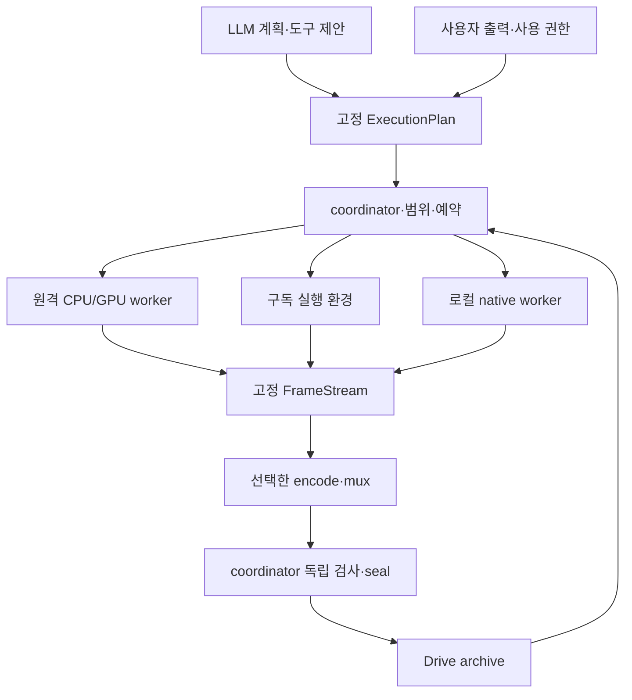
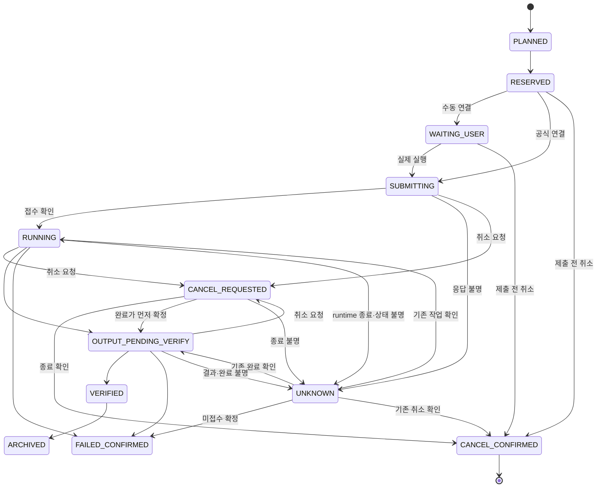

# FRAME_ANIMATION_V1 — Drive 저장·원격 실행·복수 인코더 성능 설계

설계 revision: 4 후보(DESIGN_ONLY / PENDING_APPROVAL_DO_NOT_DISPATCH), 2026-09-30 KST  
제품 코드 확인 main: 41e40478505cf75cf441dd4075c071a0fc462dbf  
원래 애니메이션 코드 검토 기준: 1f5684a8f19893d8f83f487cf329bb2425eeb25b  
선행 문서: [상세 설계](FRAME_ANIMATION_V1_DESIGN_KO.md), [개발 시작 안내](FRAME_ANIMATION_V1_DEVELOPMENT_KO.md)

User가 요청한 브라우저 Google 로그인, Drive에서 필요한 자료를 가져오는 컴파일, FFmpeg 외 인코더, AI 구독의 실행 서비스 활용, 성능 우선 방향을 구체화한다. 기능 구현·실제 연결·원격 실행·추가 과금 승인·독립 감사 PASS의 기록은 아니다.

[옵션 A 채택 결정](decisions/FRAME_ANIMATION_V1_ADOPTION_20260930.md)을 개발 범위의 근거로 삼는다. ARCHITECTURE.md·PROJECT_SPEC.md에 새 모드 예외를 연결했으며, ANIM-001에서 소비자·ADR·수용 조건을 상세 확정한다. 최초 main/CI와 중앙 운영 상태의 외부 링크는 탐색 자료이며 작성자 설명만으로 현재 감사의 검증 실적이 되지 않는다.

revision 4는 [전송·pack·완료 근거 고도화](FRAME_ANIMATION_V1_EVOLUTION_KO.md)의 후속 후보를 연결한다. 선행 #19/#20의 고정 감사 HEAD는 유지한다. 이 후보 채택 전에는 변경 계약을 운영에 적용하지 않으며, 제품/중앙 코드·실제 qualification·credential·host·activation·제작/릴리스 권한은 바뀌지 않는다.

## 1. 설계 방향

**저장 위치·실행 위치·인코더를 독립적으로 선택한다. ANIME 모드의 합성·인코딩을 PC 또는 FFmpeg에 고정하지 않는다.**

| 축 | 선택 경로 | 계약 |
|---|---|---|
| 저장 | LOCAL, GOOGLE_DRIVE | 고정 원본·채택 프레임·빌드의 바이트와 순서를 보존 |
| 실행 | LOCAL_NATIVE, REMOTE_CPU, REMOTE_GPU, SUBSCRIPTION_CODE_RUNTIME | 같은 ExecutionPlan과 프레임·색·시간축 조건을 충족 |
| 인코딩 driver | FFMPEG, NVIDIA_NATIVE, VIDEOTOOLBOX_NATIVE, GSTREAMER, QUALIFIED_SERVICE | 실제 구현·실행이 검증된 driver 선택 |
| 연결 | OFFICIAL_API, NOTEBOOK_UI, MANUAL_BROWSER_PACKET | 공식 지원 연결과 실제 사용자 동작을 명시 |
| 요금 | 기존 구독 한도, 별도 API/compute, 로컬 장비 | 각각의 권한·잔액·견적·예약으로 관리 |

성능 우선은 고난도 구현을 허용하는 설계 기준이다. 무결성·출력 품질·사용 권한·비용 상한을 충족하는 후보 중 전체 완료 시간이 가장 짧은 경로를 선택한다. 별도 API 결제·GPU 구매를 자동 승인한 것으로 해석하지 않는다.

LLM은 MotionPlan·작업 분해·도구 선택을 제안할 수 있다. 실제 픽셀 합성·코덱 계산은 그 서비스에 연결된 CPU/GPU/코드 실행 환경 또는 미디어 엔진이 수행한다. LLM 접근 권한만으로 임의 GPU·네트워크·Drive·인코더를 사용할 수 있다고 가정하지 않는다.

## 2. 원래 제안에서 변경하는 계약

본 문서가 채택 결정에 연결된 아래 항목의 새 모드 개발 정본이다. LEGACY_MV 실행 계약은 유지한다. 독립 감사와 병합 완료는 해당 exact HEAD의 별도 기록으로 확인한다.

| 원래 제안 | revision 2 |
|---|---|
| 합성·인코딩은 결정적 로컬 작업 | 결정적 FramePlan을 선택한 로컬/원격 worker가 실행 |
| FFmpeg image2 정식 출력 | FrameStream과 encode/mux driver 분리; FFmpeg는 하나의 구현 |
| 시퀀스·빌드 입력 전체 로컬 복사 | LOCAL_FULL 또는 DRIVE_BOUNDED; 후자는 검증 archive+제한된 캐시 |
| 최종 PNG 전체 로컬 디렉터리 | PNG 바이트·논리 번호·hash 보존; 로컬 폴더 또는 원격 pack+index |
| compile 전체 직렬화 | coordinator 상태·seal 쓰기 직렬화, 독립 계산 범위 병렬 실행 |
| 구독 hand-off는 글·이미지·샷 영상 | 코드 실행 packet·notebook·인코딩 export 추가 |
| ANIM-001~012 | ANIM-013~018 추가; 새 계약은 ANIM-001부터 반영 |

compile은 creative generation을 임의 실행하지 않는다. remote compose/encode는 사용자가 선택한 실행 계획·사용 권한·비용 범위 안의 컴파일 작업이다. 새 그림·구간의 모델 생성은 기존 A/B/C 제작·quote·승인 경로를 따른다.

## 3. 브라우저 Google 로그인

사용자는 Film Unit에서 Google Drive 연결을 누르고 기본 브라우저의 Google 화면에서 계정·권한·프로젝트 폴더를 선택한다. 개발자가 OAuth 앱 등록과 API 연결을 준비한다. 프로젝트 사용에 CLI·수동 token·사용자별 API 키 붙여넣기를 요구하지 않는다.

OAuth는 system browser, PKCE, state 검증과 client 유형에 맞는 공식 redirect를 사용한다. OAuth 앱/Google Cloud project와 배포 client ID의 관리 책임은 배포 책임자에게 있다. installed-app client ID는 공개 설정이며 client secret을 비밀 저장소나 인증 수단으로 신뢰하지 않는다. 이 개발 결정은 Cloud project 생성·credential 발급을 실행하는 승인이 아니다.[Google OAuth][OAUTH]

토큰은 지원 OS credential store에만 보관한다. credential store가 없거나 잠긴 환경에서는 연결을 차단하거나 사용자에게 명시한 메모리 한정 세션으로 연결한다. 기존 mode 0600 settings 파일로 OAuth token을 자동 저장하지 않는다. 로그아웃·권한 회수·계정 전환은 credential store와 메모리의 token·job 연결을 폐기하고 후속 접근을 차단한다. 프로젝트·빌드·packet·로그·GitHub에 비밀번호·refresh token·authorization code·session cookie를 넣지 않는다.

기본 범위는 앱이 만들거나 사용자가 선택해 허용한 파일의 drive.file이다. 폴더 하나 선택이 모든 기존 하위 파일의 권한을 자동 부여한다고 가정하지 않는다. 앱 전용 프로젝트 폴더·앱이 만든 pack을 우선 지원하고 기존 자료는 선택/import로 권한을 얻는다.[Google Picker][PICKER]

앱의 Drive 연결과 외부 worker의 접근은 별도 권한 경계다. 기본 경로는 coordinator가 drive.file로 허용된 고정 입력의 hash를 확인해 worker에 중개 전송하고, 검증한 출력만 archive에 쓰는 방식이다. 사용자 refresh token·OAuth access token·Drive 계정 권한은 worker나 LLM packet에 전달하지 않는다. 필요한 임시 전송 권한은 해당 job·허용 객체·읽기/쓰기 범위·단기 만료에 묶고 취소·회수하며, 수명과 접근 로그를 ExecutionPlan/receipt의 비밀 없는 메타데이터로 확인한다. worker의 직접 Drive 인증·서비스 계정 공유·사용자 token 위임은 이 기본 경로에 포함하지 않는다. 도입하려면 별도 ADR과 권한 범위 승인을 먼저 받는다. Drive 접근이 없는 runtime은 제한된 파일 packet 경로로 표시한다.

### 3.1. 계정 세대와 relay 권한 수명

브라우저 연결은 coordinator의 `connection_id`, `account_binding_digest`, `credential_epoch`에 묶는다. account binding은 검증한 계정/허용 파일 집합의 비밀 없는 로컬 식별자이며 이메일·token을 worker에 보내는 필드가 아니다. 계정 전환·로그아웃·권한 회수는 epoch를 올리고 새 read/write·submit·upload resume을 차단한다. 기존 job의 접수/종료 기록은 삭제하지 않는다. 이미 제출한 worker가 계속 실행할 수 있으므로 token 폐기만으로 CANCEL_CONFIRMED를 만들지 않으며 기존 UNKNOWN과 지출 예약은 유지한다.

relay grant는 허용된 transport 구현이 제공하는 짧은 수명의 권한이다. `job_key`, `attempt_id`, `snapshot_digest`, `object/member_digest`, 정확한 read/write range, `max_bytes`, 만료, 목적 endpoint에 묶고 object 목록 밖의 browse·목적지 선택·임의 URL fetch를 허용하지 않는다. bearer URL·upload session URI·nonce 원문은 secret storage에 두며 packet의 provenance나 일반 receipt에는 digest/식별자만 남긴다. 만료 grant 갱신은 같은 job의 같은 객체 접근만 회복하며 새 compute submit이 아니다. 완료/취소 확인·credential epoch 변경 때 폐기하고, 중단 후 재연결도 계정/권한·epoch와 원래 입력을 재검증한다. transport가 이 경계를 강제하지 못하면 그 route는 UNQUALIFIED다.

Drive의 partial read는 허용된 binary pack에 한정한다. Google Workspace 문서 export를 seekable PNG pack으로 취급하지 않는다. resumable upload의 서버 수신 offset은 전송 진척이며 SHA256 검증·archive 확정 증거가 아니다. 공식 protocol의 status query는 같은 upload session 확인이며 product compute 재제출과 구분한다. [Drive 다운로드](https://developers.google.com/workspace/drive/api/guides/manage-downloads), [Drive resumable upload](https://developers.google.com/workspace/drive/api/guides/manage-uploads)는 transport 근거이고 실제 Film Unit 연결 자격은 아래 probe로 증명한다.

기본 연결은 [고도화2.1.1](FRAME_ANIMATION_V1_EVOLUTION_KO.md)의 coordinator→고정 worker HTTPS endpoint outbound TLS/input push/output pull이다. desktop inbound listener/NAT port forwarding은 없다. 사전 허용된 peer credential과 issuer/audience·job/attempt·object/range·bytes·epoch·만료 binding을 검증하고 cross-host redirect를 거부한다. worker 인증 credential은 Drive OAuth와 별개며 새로운 credential/배포 권한을 만들지 않는다.

## 4. Drive에서 읽으며 실행하는 저장 구조

### 4.1. Archive와 workspace

| 계층 | 보관 |
|---|---|
| project revision | 계획·타임라인·asset·검수·편집의 고정 revision |
| source objects | 채택 그림·RGBA·mask·rig·영상·원곡·font의 바이트 |
| sequence packs | 순서가 명시된 PNG 멤버·exposure·프레임별 hash |
| build objects | 최종 PNG·frame_map·recipe·원곡·자막·MP4 |
| workspace | 다시 만들 수 있는 download·decode·합성·encode 임시 자료 |
| archive manifest | object ID·byte hash·멤버 순서·의존성·검증·위치 |

DRIVE_BOUNDED도 최종 프레임의 실제 PNG 바이트를 보존한다. 5,760개 연속 논리 번호·hash를 검증하며 필요하면 F_000001.png~F_005760.png 폴더로 복원한다. MP4 재추출로 보존 요건을 대신하지 않는다. LOCAL_FULL의 폴더 검사와 DRIVE_BOUNDED의 pack/index 검사·복원 검사를 각각 구현한다.

작은 파일 수천 개를 무조건 개별 요청하지 않는다. index와 독립 복원 가능한 pack으로 묶고 실제 크기·서비스 한도·변경 단위로 나눈다. PNG는 이미 압축되어 있어 archive로 묶기만 해 저장량이 크게 줄어든다고 주장하지 않는다. 후속 v1 후보의 seekable pack은 outer compression 없이 header와 PNG 원래 바이트만 고정 순서로 담는다. index는 pack 밖의 sidecar 객체이며 member offset/length/hash·pack bounds·frame coverage를 담는다. archive manifest는 pack 전체 hash/length와 sidecar index hash를 각각 pin하고 index는 pack hash 입력에 포함되지 않는다. 전체 pack hash와 부분 member 검증은 구분한다. 세부 형식·range 검증·decode 상한·fallback·restore는 고도화 설계 3~4절을 ANIM-001에서 고정한다.

content-addressed object는 앱이 덮어쓰지 않는다. 수정은 새 object/revision을 만들고 빌드는 고정 목록을 참조한다. filename·최신 수정 시각·file ID만으로 일치를 판정하지 않는다. 다운로드 바이트·멤버 hash를 manifest와 대조한다. Drive revision을 쓸 경우 실제 보존 정책을 확인하며 자동 삭제되는 revision을 유일한 원본으로 사용하지 않는다.[Drive download][DOWNLOAD]

Drive는 앱이 소유한 WORM 저장소가 아니다. 사용자가 외부에서 삭제·덮어쓰면 archive가 손상될 수 있다. 앱의 삭제·정리는 보관 빌드 참조를 확인하고 승인 원본·최종 PNG를 캐시로 분류하지 않는다. 용량 부족 시 원본을 자동 삭제하지 않는다.

### 4.2. 캐시 상한과 전송

PC·각 worker의 디스크·RAM·VRAM을 각각 예약한다. download chunk·압축 파일·해제 그림·frame buffer·prefetch·output spool·mux 임시 파일·검증 읽기까지 peak footprint에 포함한다.

READ → VERIFY → DECODE → COMPOSE → ENCODE/ARCHIVE → VERIFY → EVICT 단계로 처리한다. 소비자가 느리면 bounded queue가 생산자를 멈춘다. 업로드 지연 시 output spool을 무한히 늘리지 않는다.

작업 단위는 출력 구간과 필요한 halo다. 전환은 양쪽 컷, 보간은 anchor, 레이어는 공통 mask·rig를 포함한다. master·hold 그림은 재다운로드하지 않고 사용 중인 cache를 pin한다. 작업 분할로 원본 길이·보간 의미·노출을 바꾸지 않는다.

PC cap이 작으면 기본 coordinator 중개의 bounded stream·작은 독립 pack·검증된 remote scratch를 계획한다. 기본 이동은 Drive→coordinator→worker→coordinator→Drive이며 coordinator 위치와 edge별 전송을 기록한다. PC disk를 적게 사용해도 PC coordinator의 WAN 바이트는 없어지지 않는다. worker 자체 권한의 DIRECT_DRIVE는 별도 ADR·사용자 권한 결정·실제 qualification 전에는 후보에서 제외한다. 원격 scratch는 해당 실행 환경에 존재하며 Drive 구독 용량과 다른 자원이다. 고도화 설계 2절의 실제 위치·공유 링크·전송/검증 비용을 측정한다.

장당 평균 3MB 가정에서 4초·96장=288MB, 인접 두 컷=576MB, 전체 5,760장=17.28GB다. 입력 PNG만의 예시다. 일정한 100Mbps로 17.28GB를 읽는 이론 시간은 23.04분이며 overhead·레이어·결과 업로드는 별도다.

최소 작업 묶음이 상한보다 크면 검증된 작은 chunk·tile·다른 허용 worker를 계획한다. 분할 불가 시 필요한 용량을 표시하고 중단한다. 원본을 지우거나 해상도·품질·프레임을 조용히 낮춰 맞추지 않는다.

## 5. 실행 구조와 데이터 계약



서비스가 FrameStream을 직접 받지 못하면 허용된 파일/무손실 chunk로 연결한다. 위 그림은 coordinator 중개 기본 경로의 구현 계약이며 모든 구독 서비스의 지원 목록이 아니다. 입력과 출력의 실제 바이트 이동/위치·공유 자원은 ExecutionPlan의 transfer edge로 기록한다. worker 직접 Drive 인증은 이 그림의 숨은 전제가 아니다.

### 5.1. schema

Project 4 / Shot 3 / Build 2는 구현 전 제안이므로 ANIM-001에서 아래 소비자까지 확정한다. 각 새 schema는 1로 제안한다.

| 데이터 | 내용 |
|---|---|
| StorageArchive 1 | location·object/member hash·번호·보존·검증 |
| ExecutionPlan 1 | snapshot·operation DAG·범위·worker·연결·transfer route/edge·coordinator 위치·자원·요금·품질 |
| CapabilityEvidence 1 | 실제 runtime/driver probe·fixture·한도·유효 범위·시각 |
| EncodeRecipe 1 | driver·codec engine·format·timebase·rate control·color·mux |
| WorkerProtocol 1 | job identity·snapshot·attempt·출력·receipt·error |
| FrameStream 1 | frame index·PTS·duration·pixel/color/alpha·buffer ownership |

설명용 ExecutionPlan이다. 공간 값은 fixture 값이며 제품 기본값·충분한 용량의 보장이 아니다.

```json
{
  "schema_version": 1,
  "snapshot_digest": "<fixed-input-digest>",
  "storage": {
    "profile": "DRIVE_BOUNDED",
    "archive_manifest": "archive/index.json"
  },
  "execution": {
    "policy": "AUTO_PERFORMANCE",
    "allowed_routes": ["REMOTE_GPU", "REMOTE_CPU", "SUBSCRIPTION_CODE_RUNTIME", "LOCAL_NATIVE"],
    "capability_evidence_required": true,
    "allow_additional_charges": false
  },
  "encoding": {
    "driver_policy": "AUTO_QUALIFIED",
    "allowed_drivers": ["FFMPEG", "NVIDIA_NATIVE", "VIDEOTOOLBOX_NATIVE", "GSTREAMER"],
    "delivery_profile": "MV_H264_AAC_V1",
    "width": 1920,
    "height": 1080,
    "fps": {"num": 24, "den": 1},
    "output_frames": 5760
  },
  "workspace": {
    "pc_cache_limit_bytes": 2147483648,
    "worker_scratch_limit_bytes": 8589934592,
    "on_limit": "PAUSE"
  }
}
```

### 5.2. FrameStream

각 프레임은 0-based global index, 끝 제외 범위, rational PTS/duration, 크기·pixel format·stride·색 공간·transfer·range·alpha 정책과 source/recipe digest를 가진다. storage 경로나 encoder 이름이 프레임 시간의 정본이 되지 않는다.

buffer의 소유·수명·release, GPU device/context·동기화 fence, bounded queue/backpressure를 명시한다. encoder가 소비하기 전에 cache/buffer를 해제하지 않는다. CPU buffer·GPU surface·PNG pack 연결마다 canonical pixel/color 계약을 검사한다.

무손실 중간물과 전달 인코딩을 분리한다. 인코더가 Final PNG의 유일한 원본을 손실 압축 MP4로 바꾸지 않는다. GOP reorder가 있어도 decode 순서·표시 순서·PTS를 정확히 검증한다.

### 5.3. Worker와 작업 identity

Worker interface는 probe, preflight, submit, attach/resume, cancel, verify_artifact, release_workspace의 의미를 명시한다. 연결별 실제 구현은 API·notebook·수동 packet일 수 있다. API가 없는 소비자 웹앱에 자동 submit endpoint가 있는 것처럼 표시하지 않는다.

job key는 snapshot·operation·출력 범위·recipe·runtime/driver 계약으로 만든다. attempt ID와 submission request ID는 별도로 관리한다. 같은 작업의 불명 접수에 새 job key를 만들어 재실행하지 않는다.



UNKNOWN은 명시적 확인/reconciliation을 기다린다. CANCEL_REQUESTED는 요청 전달만 뜻하며 CANCEL_CONFIRMED는 worker 종료 또는 미접수가 확인된 상태다. 완료가 취소보다 먼저 확정되면 결과를 OUTPUT_PENDING_VERIFY로 가져와 독립 검증하고, 취소됐다는 이유만으로 완료·비용·예약 소모를 지우지 않는다. VERIFIED/ARCHIVED 빌드의 취소는 과거 seal을 변경하지 않는다. 제출 전 미접수 또는 종료 확인에 따른 예약 처리는 실제 ledger 근거로만 수행하며, 취소 자체를 provider 환불로 집계하지 않는다. 종료 불명 시 예약 해제·동일 범위 대체 worker·새 attempt를 fence한다.

FAILED_CONFIRMED 후 새 attempt는 사용자에게 실패·현재 예약·남은 retry allowance를 표시한 뒤 명시적인 이어하기 동작으로만 시작한다. 기존 bounded retry 상한과 quote·사용권·남은 예산을 재검증하고 새 attempt ID/submission request ID를 기록한다. 이는 자동 재제출이 아니며 allowance 소진·권한/가격 변경·불명 작업이 있으면 차단한다. engineering program의 빌더 재개와 제품 remote job 재시도는 서로 다른 계약이다.

같은 attempt 안의 idempotent GET/Range·공식 upload-status retry는 [고도화4.2.1](FRAME_ANIMATION_V1_EVOLUTION_KO.md)의 edge별 명시적 횟수/시간/request/byte caps 안에서만 허용한다. 미설정은 retry0이며 신규 create/compute submit/manifest 게시 불명을 자동 재시도로 해소하지 않는다. resumable write는 status로 확인한 offset 이후만 전송하며 모든 중복 bytes를 계수한다.

callback/receipt는 actor·job·attempt·snapshot·범위·request nonce에 연결하고 중복·오래된 revision을 거부한다. worker의 COMPLETE나 LLM의 완료 문장을 실제 출력 검증으로 승격하지 않는다. 상태 확인은 공식 완료 이벤트 또는 사용자의 한 번의 이어하기/가져오기 동작으로 수행한다. standing routine·주기적 status polling·소비자 UI 자동 조작을 추가하지 않는다.

여러 worker는 서로 다른 고정 계산 범위에 immutable 결과만 쓴다. 한 coordinator가 선택·receipt·coverage·build seal을 직렬화한다. 제품 계산의 병렬 worker는 engineering task의 여러 writer를 허용하는 근거가 아니다.

### 5.4. durable job journal과 중단 지점

ANIM-021은 5.3절의 상태를 append-only journal로 구현한다. 첫 network side effect 전에 고정 snapshot·operation/range/halo·recipe·실행/toolchain 계약·quote/사용권·예약·credential epoch·job/attempt/request ID와 `SUBMIT_INTENT`를 durable하게 기록한다. response/callback은 관측 기록이며 verifier가 승인한 frame coverage·hash와 분리한다. coordinator 재시작은 last verified checkpoint와 미해결 intent를 복원하며 접수 응답이 없다는 이유로 job key나 attempt를 바꾸지 않는다. 잘린·중복·순서가 다른 journal은 UNKNOWN/RECONCILIATION_REQUIRED다.

계산 checkpoint는 소비가 끝난 GPU surface나 프로세스 메모리가 아니라 검증된 immutable artifact와 receipt다. PNG/member·독립 encode fragment의 범위/출력 hash·도구 계약이 일치해야 재사용한다. 프레임을 다시 계산할 수 있다는 사실로 외부 paid submit의 UNKNOWN을 해제하지 않는다. resumable upload checkpoint는 secret session 참조·로컬 object hash·server offset·반환 object ID를 별도 기록하며, upload 완료 bytes와 member/full hash를 확인해야 archive checkpoint가 된다.

원격 provider가 idempotency key를 지원한다고 문서에 쓰여 있어도 실제 probe 전에는 중복 방지가 검증됐다고 하지 않는다. 공식 접수 확인 수단이 없는 수동 packet은 사용자 import/명시적 확인을 기다리며 자동 attach/polling을 만들지 않는다. FAILED_CONFIRMED에 대한 명시적 bounded retry, cancel/완료 경합과 지출 예약은 5.3절을 그대로 유지한다. 중앙 #47의 Fable 한도 회복 후보는 engineering audit 재개이며 제품 generation/worker retry 권한을 추가하지 않는다.

## 6. FFmpeg 외 인코더와 출력 계약

FFmpeg는 framework/driver이고 H.264·HEVC·AV1은 codec이다. NVIDIA NVENC·Apple VideoToolbox는 다른 encode 경로를 제공한다. FFmpeg 내부의 hardware flag만 추가하는 작업으로 비-FFmpeg driver 요구를 완료 처리하지 않는다.

| driver | 구현 방향 | qualifier |
|---|---|---|
| FFMPEG | CPU/hardware encoder를 FrameStream·pipe·시퀀스에 연결 | 기존 회귀 및 새 프레임·색·PTS 검사 |
| NVIDIA_NATIVE | Video Codec SDK/PyNvVideoCodec 등 native API | 실제 GPU·driver·NVENC session·지원 format probe |
| VIDEOTOOLBOX_NATIVE | VTCompressionSession과 native mux 경로 | 실제 OS·hardware encoder 활성화·codec·color 검사 |
| GSTREAMER | appsrc에서 buffer를 받아 지원 plugin·muxer로 연결 | 설치 plugin·queue 상한·frame PTS·flow 검사 |
| QUALIFIED_SERVICE | 공식 API 또는 수동 export 서비스 | sequence/timeline·codec·원음·프레임 정확성·다운로드 입증 |

NVIDIA는 hardware encode API와 H.264·HEVC·AV1 경로를 제공한다.[NVIDIA][NVENC] VideoToolbox는 video frame sequence를 compression session으로 받는다.[Apple][VT] GStreamer appsrc는 application buffer를 pipeline에 넣을 수 있다.[GStreamer][GST] 이는 연결 가능성의 공식 근거이며 Film Unit 구현·성능 증거가 아니다.

CUDA 연산용 GPU가 있다는 사실만으로 NVENC를 사용할 수 있다고 판단하지 않는다. 실제 설치 GPU의 encode engine·driver·권한·해당 codec을 테스트한다. ffmpeg 존재만으로 GPU driver를 QUALIFIED로 표시하지 않는다.

### 6.1. 분리할 interface

- FrameSource/Decoder: frame·PTS·원본 대응을 제공.
- Compositor: 노출·transform·mask·전환·색·자막을 실행.
- Encoder: 고정된 시각 자료를 codec packet으로 변환.
- Muxer: 영상 packet과 원곡 기반 audio track을 container에 배치.
- MediaVerifier: decode frame count·PTS·색·음원·파일 무결성을 검사.
- ArchiveWriter: 실제 PNG·recipe·frame_map·완료 artifact를 보관.

native video encoder가 AAC·자막·container까지 모두 처리한다고 가정하지 않는다. 원곡의 지정 sample 범위와 AAC track을 보존하고 필요하면 별도 audio/mux 구현을 연결한다. 이미 검증한 audio track을 매 chunk 다시 인코딩하지 않는다.

### 6.2. 품질·시간축·전달 profile

기존 전달 기준은 H.264/AAC MP4·프로젝트 크기·24/1 CFR·지정 색/원곡 정책이다. HEVC·AV1·다른 container는 사용자가 선택한 별도 DeliveryProfile로 확정한다. 빠른 driver 때문에 수신자의 codec 호환성·품질을 조용히 바꾸지 않는다.

driver마다 bitrate·quality control 의미가 다르므로 같은 CRF/quality 숫자가 같은 결과를 뜻한다고 가정하지 않는다. 같은 무손실 기준 프레임을 입력하고 선·색 경계·깜빡임·작은 글자·투명 경계·banding과 시간축을 비교한다. 품질 profile의 검사·허용 범위를 ANIM-001/015에서 고정하고 후보별로 완화하지 않는다.

다른 encoder/device에서 MP4 바이트가 같다고 보장하지 않는다. 실제 승인한 PNG·MP4는 정확한 바이트로 보존한다. 재인코딩은 새 artifact이며 승인 binding을 다시 확인한다. GPU 합성의 precision·rounding·색 변환은 고정하고 기준과 다른 출력을 품질 검증 없이 canonical로 채택하지 않는다.

### 6.3. 전체 인코딩과 구간 인코딩

전체 FrameStream의 한 번의 연속 인코딩과 독립 fragment 인코딩을 모두 설계한다. 전자는 전체 rate control에 유리할 수 있고 후자는 병렬화·복구 단위를 줄일 수 있으므로 같은 품질·총 완료 시간으로 비교한다.

fragment는 독립 decode 가능한 GOP·경계·parameter set·codec profile·timebase·color·sample description을 갖춰야 한다. 임의 MP4 파일의 단순 byte concat을 완성 영상으로 간주하지 않는다. 호환 fragment만 올바른 mux로 연결하고 프레임 중복·누락·경계 품질·audio sync를 검사한다. 조건 불충족 시 단일 최종 encode를 실행 계획에 포함한다.

## 7. AI 구독 실행 서비스 연결

### 7.1. 실제 능력과 연결 방식

| 후보 | 확인된 근거/제약 | 설계상 위치 |
|---|---|---|
| ChatGPT 코드 실행 | Python/Jupyter 및 제공된 파일 사용; Python 환경의 외부 web/API 요청 불가 | 작은 파일 packet의 합성/인코딩 후보; 실제 도구·크기 probe 후 수동 결과 import |
| ChatGPT 파일 연결 | 계정별 connector로 Drive 파일 첨부 가능; 실제 다운로드·실행 한도와 별개 | 첨부된 자료 처리; Drive 직접 스트리밍을 자동 보장하지 않음 |
| Colab 계열 runtime | hosted notebook·유료 compute 후보; hardware·수명·자원 동적 | notebook UI 실행 후보; 실제 자원·원격 scratch·Drive I/O·encoder qualification |
| 기타 AI/미디어 구독 | 서비스별 공식 지원 기능 확인 필요 | 코드 실행/정확한 timeline export가 입증된 범위만 등록 |
| 별도 API/원격 worker | 해당 연결·권한·요금·자원 입증 필요 | 자동 실행 가능 후보; 기존 구독 포함과 구분 |

OpenAI 공식 안내는 코드 실행의 외부 요청 제약과 파일 업로드 한도를 명시한다. [ChatGPT analysis][CHATGPT_ANALYSIS] [ChatGPT files][CHATGPT_FILES] ChatGPT 구독과 별도 API 요금도 구분한다. [Subscription][CHATGPT_SUB] Colab은 자원·hardware·Drive 전송이 일정하다고 보장하지 않는다. [Colab][COLAB] 특정 서비스가 4분 작품 전체를 한 번에 처리할 수 있다고 이번 설계에서 확정하지 않는다.

예를 들어 Drive 접근이 없는 sandbox는 처음부터 DRIVE_DIRECT route 후보에서 제외한다. 허용된 크기의 packet을 사용자가 첨부해 실행하는 경로는 별도로 제공한다. Drive connector가 있다는 이유로 코드 sandbox가 Drive API를 직접 호출할 수 있다고 가정하지 않는다.

샷 영상 생성 기능이 있다는 사실만으로 이미 채택된 5,760장의 정확한 시퀀스·원곡을 인코딩하는 기능이 있다고 판단하지 않는다. 시각 자료를 새로 생성/변형하는 서비스는 A/B/C 제작 후보이고 정확한 compiler encoder로 자동 등록하지 않는다.

### 7.2. 구독 사용권과 실제 probe

CapabilityEvidence에는 서비스·계정 사용 경로·확인 시각·runtime/OS/driver·CPU/GPU/encoder·입출력 한도·network·Drive read/write·max scratch·취소/완료 방식·검증 fixture 결과를 기록한다. 비밀값은 기록하지 않는다.

지원 상태는 UNQUALIFIED → DOCUMENTED_ONLY → QUALIFIED_FOR_SCOPE로 구분한다. scope는 실제 검사한 operation·format·frame 수·공간·연결 방식이다. 문서나 서비스 이름만으로 QUALIFIED를 만들지 않는다. session/device가 바뀌거나 근거가 오래되면 필요한 probe를 다시 한다.

subscription allowance·compute unit·API credits·USD·human hand-off 시간을 분리한다. 포함 범위가 확인되지 않으면 추가 과금이 없는 경로로 표시하지 않는다. 구독 소진·UNKNOWN 접수·자원 거절은 다른 계정이나 유료 API로 자동 우회하지 않는다.

### 7.2.1. CapabilityEvidence와 실행 eligibility의 갱신 계약

ANIM-019는 후보 이름 목록과 실제 실행 허용을 분리하는 registry를 제공한다. `evidence_id`, `provider/adapter/worker_digest`, service/account의 비밀 없는 binding·credential epoch, session/device/OS/driver, operation·pixel/color/codec·해상도·frame/range·입출력/scratch/시간 cap, route/transport, 검증 fixture/input/output digest와 관측 시각, 사용권 근거·통화별 allowance·만료/재검증 조건을 기록한다. qualification에 쓴 시험과 production 요청의 operation/scope·현재 환경을 비교하여 superset 추론 없이 허용한다. CPU compose 성공으로 native encode, CUDA 접근으로 NVENC, 글 모델 구독으로 GPU 실행·Drive network·상용 API 크레딧을 허용하지 않는다.

eligibility는 `DOCUMENTED_ONLY / QUALIFIED_FOR_SCOPE / STALE / UNAVAILABLE` 등의 registry 상태를 이유와 함께 계산한다. 이는 프로그램의 qualification facet를 대체하는 enum이 아니다. 실제 scope 일부만 검사했으면 전체 목표 qualification은 PARTIAL이고 나머지는 UNQUALIFIED다. 새 session/device/driver/worker·사용권/계정·route·한도 변경 및 evidence 만료는 기존 probe를 적용 불가로 만들며 다시 probe하거나 사용자 확인을 기다린다. UNKNOWN 작업은 새 자격 증거로도 해제하지 않는다. probe 자체의 유료 실행·credential provisioning은 별도 허용 범위가 필요하다.

AUTO_PERFORMANCE는 eligibility를 먼저 통과한 후보만 계산한다. 측정은 input/quality digest·cold/warm·start/auth/queue·각 stage와 공유 edge·peak disk/RAM/VRAM·전송량·사용량·수동 hand-off 시간을 같은 조건으로 묶는다. 표본 수·관측 구간·변동·누락을 보고하고 측정이 없으면 UNKNOWN으로 표시한다. 실제 예상 시간이 겹치면 사용자가 허용한 우선순위로 결정하고, 미검증 서비스를 빠르다는 모델 추론으로 선택하지 않는다. LLM은 이 고정 evidence를 설명/계획하는 역할이며 매 프레임 계산 권한의 근거가 아니다.

### 7.3. 사용자 흐름과 packet

Film Unit에서 저장소 연결 → 실행 서비스 선택 → 자원 확인 → 품질/공간/비용/예상 시간 확인 → 컴파일 순서로 진행한다. 수동 runtime은 브라우저/notebook에서 누를 동작과 가져올 결과를 보여준다. 사용자에게 CLI 실행을 요구하는 기본 흐름을 만들지 않는다.

packet은 plan·snapshot hash·입력 index·필요 파일/권한·고정 worker version·실행 단위·기대 출력·검증 조건·receipt 형식을 담는다. 앱이 제공하는 실행 코드와 버전/hash를 명시하고 임의 다운로드 script를 자동 실행하지 않는다.

소비자 사이트 로그인·프롬프트 입력·다운로드를 화면 자동 조작으로 대체하지 않는다. 공식 실행 API가 있는 서비스만 자동 submit driver를 갖는다. notebook 경로는 해당 서비스의 UI·공식 연결 안에서 사용자가 실행하며 세션을 우회해 상시 daemon으로 만들지 않는다.

## 8. 성능 우선 scheduler

### 8.1. 경로 선택

후보는 출력 계약·검수·실제 capability·사용 권한·공간·예산을 먼저 통과해야 한다. LLM의 제안은 실제 eligibility 검사와 측정을 통과한 뒤 ExecutionPlan에 반영한다.

AUTO_PERFORMANCE는 startup/auth/queue, Drive read, decode, 합성, encode, audio/mux, archive write, 검증·seal까지 end-to-end 시간을 예측한다. 겹쳐 실행되는 stage는 단순 합산하지 않고 DAG의 critical path·대역폭·자원 경합으로 계산한다. 같은 품질에서 전체 완료 시간, PC peak storage, 전송량, 구독 사용량, 별도 비용을 표시한다.

기본 relay의 원격 계산 경로를 qualification하고 coordinator 위치·edge별 실제 이동을 포함해 비교한다. worker가 자체 Drive 권한으로 직접 처리하는 DIRECT_DRIVE는 별도 ADR·사용자 권한 결정·scope qualification 전에는 AUTO_PERFORMANCE 후보에서 제외한다. 사용자가 REMOTE_ONLY를 선택하면 로컬 계산으로 자동 전환하지 않는다. REMOTE_ONLY도 coordinator relay와 PC 네트워크 경유 여부를 숨기지 않는다. API 경로와 수동 packet 경로는 사람의 시작·첨부·가져오기 시간을 포함해 비교한다.

GPU 광고 성능이나 encode fps만으로 전체 작업이 빠르다고 판정하지 않는다. 실제 GPU/runtime의 cold/warm, 입력 종류·크기·색 변환, Drive 위치·read/write throughput, scratch, codec 품질을 측정한다. Colab 공식 안내도 Drive와 runtime의 위치 차이와 많은 작은 파일 I/O의 부담을 설명한다.[Colab][COLAB]

### 8.2. 실제 최적화

- 공통 자산과 채택 그림을 content digest로 재사용하고 영향 범위만 재합성.
- coordinator가 검증한 고정 멤버만 remote worker에 중개 전송하고, worker 내 공통 cache 유지. DIRECT_DRIVE는 별도 권한/qualification을 갖춘 후속 범위.
- 전송·decode·합성·encode·archive의 bounded pipeline과 제한된 prefetch.
- 자원 예약 범위에서 독립 컷/출력 구간 병렬화, 전환·anchor halo 사전 계획.
- 검증된 GPU decode/합성/encode와 zero-copy surface 연결; color 변환·불필요한 readback 최소화.
- CLEAN/SUBBED의 공통 합성 재사용; 자막 차이와 독립 cue를 유지.
- 임시 PNG 전체 디스크 적재 대신 FrameStream 소비와 작은 보존 pack.
- worker가 이미 가진 입력·구간·artifact를 사용해 재전송·재실행 최소화.
- 큰 입력·큰 레이어는 검증한 tile/strip 경로 사용; 최종 픽셀 조건 유지.

LLM은 프레임마다 새 계획·token 추론을 필수로 하지 않는다. 계획과 변경 판단을 위한 모델 작업을 분리하고 프레임 반복 계산은 고정 엔진이 수행한다.

cache key는 source/recipe/format/toolchain 내용과 위치·인코더 artifact 계약을 구분한다. 저장 위치만 바뀌어 같은 frame content가 다시 생성되지 않게 한다. encoder·delivery profile을 바꾸면 encoded artifact는 별도 key다. cache hit도 current approval을 별도로 확인한다.

부분 수정은 seekable pack의 필요 member/halo만 요청하는 경로와 검증된 whole-pack fallback을 구분한다. member hash 검증 없이 decoder로 넘기지 않는다. request 수·실제 edge별 bytes·range/read/decode amplification을 보고하고, cap 밖 whole-pack 응답은 받지 않는다. 구체 수용 fixture는 고도화 설계 6절이다.

### 8.2.1. 변경별 invalidation과 출력 provenance

ANIM-020의 세부 규칙은 상세 설계 11.5절을 따른다. scheduler는 source/recipe dependency graph의 변경 closure를 구하고 실제 필요 member/halo, compose ranges, encode artifact, 기술 검사 및 stale approval을 각각 출력한다. 저장 locator만 이동한 변경, 미채택 후보 추가, 검수 메모는 pixels를 재계산하지 않는다. font/cue 변경은 clean 시퀀스와 컷 동작 검수를 재사용할 수 있지만 subbed 시퀀스·출력 검수는 stale이고, encoder/profile 변경은 PNG를 재사용해도 새 MP4/전달 승인이 필요하다. 실측 없이 cache hit ratio나 speedup을 완료 성과로 보고하지 않는다.

### 8.3. failure·비용·성능

네트워크 단절·quota 거절·runtime 종료·GPU 미지원·archive 지연은 명시적 상태로 보고한다. 세션 수명보다 큰 작업은 검증된 작은 checkpoint로 나눈다. 이미 원격 보관·검증된 checkpoint부터 재개한다.

자동으로 비용 경로·provider·계정을 바꾸지 않는다. 초기 계획의 허용 후보와 실행 중 failure 후 대체 submission은 구분한다. UNKNOWN 작업이 남아 있으면 다른 worker의 동일 작업 제출을 fence한다. 새 계획·비용 변동은 기존 quote/예약/사용자 범위와 대조한다.

Drive의 rate/전송·계정 저장 한도도 preflight와 usage guard에 넣는다. API 관련 한도·청구 기준은 Cloud 프로젝트에 따라 확인하고 무제한 무료 전송으로 표현하지 않는다.[Drive limits][DRIVE_LIMITS]

## 9. 원격 보관 빌드·seal·replay

1. source/plan의 고정 snapshot과 필요한 artifact 목록을 만든다.
2. worker 결과를 입력 snapshot·범위·recipe와 대조한다.
3. lossless PNG·frame_map·metadata·원곡·자막·font·MP4의 archive 객체와 hash를 검사한다.
4. 프레임 coverage·전환 경계·decode PTS·원음 sample/동기·color·subtitle·container를 검증한다.
5. 모든 필요한 객체가 보관됐을 때 완료 manifest를 마지막에 공개한다.
6. 실제 출력의 사람 검토·최종 승인은 sealed build에 별도 연결한다.

required artifact별 archive verification은 [고도화4.2.2](FRAME_ANIMATION_V1_EVOLUTION_KO.md)를 따른다. 로컬 전송 hash/offset/성공 응답만의 UPLOADED_UNVERIFIED는 archive checkpoint/seal에 부족하다. 완료 seal에는 최소 UPLOAD_HASH_MATCHED(인증된 provider의 실제 고정 object SHA256·length 일치)가 필요하며, 그 강한 checksum 근거가 없으면 bounded FULL_READBACK을 요구한다. profile의 더 강한 required level을 면제하지 않고 index/member/full-pack integrity와 저장 검증 level을 별도 manifest에 기록한다. readback 비용/bytes/공간도 사전 예약한다.

Drive 다중 파일 업로드를 하나의 atomic transaction으로 가정하지 않는다. 객체 생성·업로드 확인·완료 manifest 공개의 idempotent 절차와 crash reconciliation을 구현한다. 완료 공개 접수가 불명확하면 같은 build identity로 확인하며 새 COMPLETE 레코드를 임의 생성하지 않는다.

ENCODED·RENDERED·UPLOADED는 COMPLETE가 아니다. 최종 PNG나 source 보관이 미완료인 빌드는 archive pending으로 표시한다. 검증 끝난 chunk를 소비한 뒤 필요 없어진 임시 cache만 정리한다. archive를 가리키는 index만 먼저 만들고 원본 없이 성공 처리하지 않는다.

LOCAL_FULL은 기존 독립 복사·offline replay 계약을 유지한다. DRIVE_BOUNDED는 archive 접근을 요구하는 online replay다. offline restore를 요청하면 완전한 archive 다운로드·검증·복원 용량을 별도로 확인한다. Drive 접근이 안 되는데 offline 재현 가능하다고 표시하지 않는다.

remote replay도 live project 없이 고정 archive·recipe·toolchain을 사용한다. workspace는 PC 또는 허용된 원격 worker에 있을 수 있다. 과거 승인 MP4의 바이트 보존과 새 encode의 결과를 구분한다. archive 손상·접근 취소·입력 불일치 시 대체 최신 자료로 계속하지 않는다.

### 9.1. archive commit과 build seal의 재개 계약

ANIM-021의 commit key는 coordinator가 선점한 build ID·snapshot·ordered required artifact 목록·recipe와 toolchain/검증 profile digest에 묶인다. 단계는 `OBJECTS_PENDING → OBJECTS_VERIFIED → MANIFEST_INTENT → SEALED`이며 unknown publication은 `SEAL_UNKNOWN`으로 fence한다. 객체는 immutable staging으로 올리고 locator/length/bytes hash를 검증한다. member 검증과 full-pack 검증은 manifest에서 각각 기록하며 검증 범위를 부풀리지 않는다. 필요한 원본·최종 전달 PNG 시퀀스·clean 재현 recipe·frame_map·원곡·cue/font·clean/subbed MP4가 모두 보관/검증되기 전에 완료 manifest를 공개하지 않는다. clean PNG 전량을 추가 보관하는 profile은 별도 선택·용량 예약 대상이며 기존 전달 PNG 보존만을 이유로 두 시퀀스를 자동 이중 적재하지 않는다.

완료 manifest bytes는 순서가 고정된 artifact hash/coverage·source snapshot·render/encode/verification 계약과 journal reference를 담는다. 그 manifest의 digest는 외부 seal/approval 레코드가 참조하며 자기 digest·나중 승인/accepted 상태를 입력에 넣지 않는다. manifest network 공개 전에 `MANIFEST_INTENT`를 durable하게 기록한다. 응답을 잃으면 같은 build identity와 고정 manifest bytes의 게시 여부를 확인하며 새 manifest/COMPLETE를 중복 생성하지 않는다. 이름 검색 결과 하나만으로 일치라고 하지 않고 digest/bytes/required inventory를 검증한다. 여러 후보나 게시 여부 불명은 SEAL_UNKNOWN이며 기존 승인 빌드를 덮어쓰지 않는다.

Drive는 다중 객체 atomic commit 또는 WORM을 제공한다고 가정하지 않는다. 앱의 단일 coordinator seal과 content 검증으로 유효한 완료 view를 제공하고, 외부 삭제/권한 회수는 ARCHIVE_UNAVAILABLE/INTEGRITY_FAILED로 별도 표시한다. 과거 seal 원본은 유지하며 뒤늦은 archive 손상에도 현재 replay 가능을 주장하지 않는다. 삭제는 참조·보존 정책에 따라 명시적으로 승인된 orphan staging만 처리하고, 실패한 job 결과나 채택 원본을 cache eviction으로 제거하지 않는다.

## 10. 모듈·UI·개발 항목

### 10.1. 모듈

| 제안 모듈 | 책임 |
|---|---|
| storage_backends/local.py, drive.py | object·archive·chunk read/write·권한·usage |
| archive_manifest.py | 고정 object/member·retention·완료 공개·verify/restore |
| workspace.py | PC/worker 공간 예약·pin/evict·RAM/VRAM 상한 |
| frame_stream.py | 정확한 프레임·PTS·pixel/color·buffer ownership |
| execution_plan.py, execution_scheduler.py | DAG·capability·측정·경로·자원·비용 계획 |
| execution_workers/local.py, remote.py, subscription.py | probe·submit·receipt·resume·cancel |
| encoder_backends/ffmpeg.py, nvidia_native.py, videotoolbox.py, gstreamer.py, service.py | encoder별 native/pipe/service 연결 |
| media_mux.py, media_verify.py | 원음·container·독립 decode/PTS/quality 검사 |
| execution_packets.py | 고정 입력·worker·기대 출력·수동/notebook hand-off |

새 파일명을 모두 만들고 구현 완료로 처리하지 않는다. 기존 모듈과 통합할 실제 파일은 구현 PR에서 확정하며 위 책임은 유지한다.

UI는 저장소/프로젝트 연결, 실행 서비스와 실제 지원 상태, 출력 품질·예상 시간·PC/worker 공간·요금, 시작·중단·이어하기·결과 검증·복원을 제공한다. hash·codec 내부 옵션은 상세 화면에 둔다. 사용자가 작업을 결정할 때 필요한 제약과 수동 동작은 숨기지 않는다.

### 10.2. 개발 항목

| 항목 | 선행 | 범위 | 완료 증거 |
|---|---|---|---|
| ANIM-013 Drive 저장 | 001, 003, 006 | browser OAuth·archive·bounded cache·restore | pack/members 보존, corrupt/access/공간/끊김 검사, 브라우저 UI |
| ANIM-014 실행 계약 | 001, 004, 007, 013 | FrameStream·ExecutionPlan·worker·receipt·UNKNOWN | 로컬+실제 허용 remote의 같은 frame 계약, stale/중복/불명 fence |
| ANIM-015 복수 인코더 | 001, 004, 006 | encode/mux/verify 분리·native driver | FFmpeg와 독립 native 경로가 같은 전달 profile·frame/PTS/audio 조건 충족 |
| ANIM-016 구독 실행 | 009, 014, 015 | entitlement·probe·packet/notebook·import | 실제 한 서비스의 입출력·한도·도구·결과 검사; 자동/수동 표기 |
| ANIM-017 성능 scheduler | 005, 013~016 | 부분 재컴파일·parallel·prefetch·zero-copy 후보 | 동일 품질 end-to-end cold/warm·공간·전송·복구 비교 |
| ANIM-018 원격 통합 | 008, 012~017 | User-only 실제240초·1080p·Drive→worker→archive·desktop UI qualification | exact source/route/artifact 실제 실행·검증 보관·복원·실패/성능 evidence를 User가 승인하기 전 merge/DONE 금지; 환경 부재면 WAITING |

ANIM-001에 storage/execution/encoder 계약을 먼저 넣는다. ANIM-013~015는 각 기반 기능이 생기는 시점부터 세로 기능으로 구현하고 ANIM-012가 끝날 때까지 모든 원격 설계를 미루지 않는다. 로컬 기준선은 parity·회귀 비교용이며 최종 성능 모드를 PC 전용으로 고정하는 완료 조건이 아니다.

실제 서비스 권한·자원이 아직 없으면 fake worker로 protocol을 검사하고 runtime qualification은 미완료로 남긴다. fake 성공을 실제 구독 원격 실행이나 성능 완료로 집계하지 않는다. AIOPS 착수 task는 해당 명세를 pin하고 실행 소유자·reviewer·현재 HEAD를 기존 규칙에 연결한다. 이 항목명은 dispatch/control record가 아니다.

고도화 설계 5절의 `node_state`, `qualification_state`, `acceptance_state`, `release_state`를 독립 근거로 보고한다. 개발 DONE은 host-pinned delivery의 실제 merge 근거만 뜻한다. 필요한 qualification/acceptance를 자원 부재 때문에 NOT_REQUIRED로 면제하지 않는다. ANIM-018은 user_merge=true/astra_auto_merge=false인 actual qualification task다. 실제 허용된 한 경로의240초 통합·archive/replay/restore·UI·실패/verification fixture evidence와 User의 exact-set 승인이 merge 선행 조건이며, 부재면 WAITING이고 code/fake PASS만으로018 merge/DONE을 허용하지 않는다. 앞선 개발 delivery와 실제 작품 승인/공개 release는 별도다. 해당 중앙 집계 기능을 채택/구현하기 전에는 draft 증거 표로 미완료를 유지한다.

## 11. 수용 테스트와 성능 보고

| 범위 | 검증 |
|---|---|
| Drive OAuth | 사용자 거절·만료·다른 계정·권한 부족·공유 packet의 credential 부재 |
| 원격 원본 | 수정/삭제/순서 변경·pack hash/멤버 hash 불일치 차단 |
| bounded storage | peak PC/worker disk·RAM·VRAM·spool 포함 상한, pin 중 eviction 차단 |
| 파이프라인 | 소비 지연·upload stall에서 backpressure, 캐시 해제 후 원본 보존 |
| 프레임 | ones/twos·홀수 끝점·96+96−12=180·halo·전환 경계·5,760 coverage |
| 병렬 | out-of-order receipt·중복 범위·누락·stale snapshot·동시 seal 차단 |
| 작업 | UNKNOWN·늦은 완료·cancel 불명·runtime 종료 후 같은 identity reconciliation |
| encoder | CPU 기준/독립 native/GStreamer/service의 실제 지원 profile·color·PTS·audio |
| 비-FFmpeg | NO_FFMPEG_ENCODING 경로 실제 성공; 완전한 NO_FFMPEG_RUNTIME은 별도 probe·mux/verify 구현 근거. 2026-10-08에 JunTae가 anim-015의 NO_FFMPEG_ENCODING 요구를 면제함([인코딩 경로 결정](ANIM_015_ENCODING_DECISION_KO.md)). |
| 구독 | 외부 network 없음·파일 한도·GPU 없음·session expiry·사용량 소진의 명시적 처리 |
| 요금 | 구독/API 분리·견적 변경·예약·추가 과금 거절·대체 provider 무단 제출 차단 |
| archive | upload 불명·검증 실패·완료 manifest crash·pack restore·Drive 해제 시 미완료 표시 |
| replay | live project 없이 online replay; offline restore의 추가 공간·접근 조건 |
| relay topology | coordinator 위치와 edge별 실제 이동·공유 링크·spool 상한; 미승인 DIRECT_DRIVE 후보 제외 |
| seekable pack | sparse member/halo read·offset/length/index hash·member/full-pack 검증 구분·206/200/mismatch·decode cap·bounded restore |
| 완료 facets | merged 개발 delivery·실제 qualification·수용 gate·작품 승인·release의 독립 근거; fake/접근 부재의 readiness 오표시 차단 |
| regression | 원곡/가사/검수 binding·Build 1·기존 Preview/Final·desktop 유지 |

성능 fixture는 240초·24fps·5,760프레임·1920×1080에 실제 위치·그림 교체·가림·레이어·전환·자막이 변하는 합성 자료를 사용한다. 작은 CI correctness fixture와 실제 품질/성능 자격 시험은 분리한다. 실제 W00과 작품 승인도 별도다.

최소 비교는 로컬 CPU 기준선, 실제 허용 remote CPU/GPU, 한 개 이상의 독립 native encoder, 실제 구독 실행의 검증된 범위다. 없는 hardware/service의 결과를 가정으로 채우지 않는다. 수동 서비스는 사람 동작 시간을 포함한다.

보고서에는 runtime/device/toolchain·delivery profile·input snapshot·network 위치/측정·cold/warm, 전체 완료 시간과 stage timeline, peak PC/worker disk/RAM/VRAM, read/write bytes·cache hit·encode throughput·품질 비교·사용량/비용·중단 후 손실/재개 범위를 기록한다. 대표적인 반복 측정의 분포와 변동을 보여주고 단일 best-case를 일반 성능으로 홍보하지 않는다.

지금은 구현·벤치마크가 없다. 몇 배 가속·몇 GB면 충분·4분을 특정 시간 안에 완료 같은 수치는 약속하지 않는다. benchmark와 실제 artwork 수용 조건을 충족한 후보만 AUTO_PERFORMANCE에 등록한다.

## 12. 근거와 개발 운영

source 및 service 문서는 2026-09-30에 확인했다. 코드 baseline 이후 main의 PR #18은 governance 변경이다. program-mode task에는 그 task envelope와 M1/M5 규칙이 적용되며, 이 직접 사용자 지시의 설계 PR은 program dispatch/activation을 시작하지 않는다.

본 revision은 storage·execution·schema·authority·비용 경계에 영향을 주는 A3 설계 범위다. 작성자의 문서 검증을 독립 감사로 기록하지 않는다. 현재 제품 코드·credential·repo setting·유료 service·control-plane runtime은 이 문서로 변경되지 않는다.

| 공식 근거 | 이번 설계에서 사용하는 사실 |
|---|---|
| Google OAuth/Picker | 기본 브라우저 인증·동의·선택 파일 접근 |
| Drive downloads/limits | 바이너리/부분 읽기·revision 보존·요청/전송 한도 |
| ChatGPT analysis/files/subscription | 코드 환경·외부 요청 제약·파일 한도·API 과금 분리 |
| Colab FAQ | notebook compute·동적 자원·Drive I/O·runtime scratch 구분 |
| NVIDIA SDK | native hardware encode API·codec·device 지원 확인 |
| Apple VTCompressionSession | frame sequence encode session |
| GStreamer appsrc | application buffer를 pipeline으로 전달 |

[OAUTH]: https://developers.google.com/identity/protocols/oauth2/native-app?hl=en
[PICKER]: https://developers.google.com/workspace/drive/picker/guides/desktop-mobile-picker
[DOWNLOAD]: https://developers.google.com/workspace/drive/api/guides/manage-downloads?hl=ko
[DRIVE_LIMITS]: https://developers.google.com/workspace/drive/api/guides/limits?hl=ko
[CHATGPT_ANALYSIS]: https://help.openai.com/en/articles/8437071-data-analysis-with-chatgpt
[CHATGPT_FILES]: https://help.openai.com/en/articles/8555545-file-uploads-faq
[CHATGPT_SUB]: https://help.openai.com/en/articles/6950777-what-is-chatgpt-plus
[COLAB]: https://research.google.com/colaboratory/faq.html
[NVENC]: https://developer.nvidia.com/video-codec-sdk
[VT]: https://developer.apple.com/documentation/videotoolbox/vtcompressionsession
[GST]: https://gstreamer.freedesktop.org/documentation/applib/gstappsrc.html
